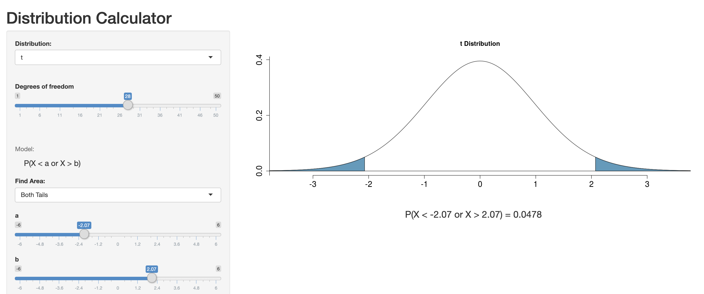

```{r xaringan-themer, include=FALSE}
# sds::duo_smith()
sds::mono_light_smith()
```

```{r setup, include=FALSE}
knitr::opts_chunk$set(echo = FALSE)
library(tidyverse)
library(broom)
library(ggridges)
library(knitr)
library(Stat2Data)
```

class: middle, inverse, center

# Regression Assumptions

---
# Regression Assumptions

- Linearity
- Independence
- Normality
- Equal Variance (_Uniform Spread_)
- Zero Mean
- Randomness

---
# AKA - **LINE_RZ_**

- **L**inearity
- **I**ndependence
- **N**ormality
- **E**qual Variance
- *R*andomness
- *Z*ero Mean

---
# **I_RZ_**: Independence, Randomness, & Zero Mean

- Hard to tell Visually - Have to know something about the data
  - **I**ndependence
    - Does information on one observation tell you anything about another observation
  - *R*andomness
    - Needed for inference from estimated sample statistics to a population parameter

- *Z*ero Mean
  - Met mathematically by how the line is fit

---
# **L N E**: Linearity, Normality and Equal Variance

## Illustrated well in diagnostic plots

- **ALL:** Residual - Fitted Plots

- **Normality**: Histogram and/or QQ / Normal Probability Plot

---
class: middle, center

# **L N E**: Linearity, Normality and Equal Variance

# First: when assumptions are met 

# Second: illustrate assumption _violations_

---
class: middle, center

# **L N E:**  Scatterplot

```{r}
set.seed(20)
x <- seq(from=0, to=100, by=0.1)
y1 <- 500 + 2*(x-4)
noise <- rnorm(length(x), mean=10, sd=10)
y <- noise + y1
assumptions_1<-as.data.frame(cbind(y,x))
```

```{r, fig.height = 5.5, fig.width= 10}
qplot(y=y, x=x, data=assumptions_1) + theme_bw() + geom_smooth(method = "lm", se=FALSE)
```


---
class: middle, center

```{r, fig.height = 5.5, fig.width= 10}
assumptions_lm<-lm(y~x, data=assumptions_1)
assumptions_df<-augment(assumptions_lm)
assumptions_df$YHat <- cut(assumptions_df$.fitted, seq(500, 700, 25), include.lowest = TRUE)
```

# **L N E:** Linearity, Normality & Equal Variances

.pull-left[ 
### Residual-Fitted Plot

```{r, fig.height = 6}
qplot(x = .fitted, y = .resid, data = assumptions_df) + geom_hline(yintercept = 0, color="red") +theme_bw()
```

]

.pull-right[
### Distributions

```{r, fig.height = 6, warning=FALSE, messsage=FALSE, error=FALSE}
suppressMessages(print(
  ggplot(assumptions_df,aes(x = .resid, y = YHat)) + 
  geom_density_ridges() +
  xlab("Residuals") + ylab("Fitted Values (estimated value of y-hat)") + 
  #theme(axis.text.x = element_text(angle=45)) +
  scale_y_discrete(labels=  c("500", "525", "550", "575", 
                              "600", "625", "650", "675",
                              "700")) +
  coord_flip()
))

 # assumptions_df %>%
 # summarise(mean_1stgrp = mean(.resid),
 #          sd_1stgrp=sd(.resid))

# assumptions_df %>%
#     #filter(YHat %in% c("(525,550]", "(1.05e+03,1.08e+03]")) %>%
#     group_by(YHat) %>%
#   summarise(mean_1stgrp = mean(.resid),
#          sd_1stgrp=sd(.resid))

```
]

---
class: middle, center

## Equal Variance & Statistical Inference

```{r, fig.height = 6, fig.width = 10, warning=FALSE, messsage=FALSE, error=FALSE}
suppressMessages(print(
  ggplot(assumptions_df,aes(x = .resid, y = YHat)) + 
  geom_density_ridges() +
  xlab("Residuals") + ylab("Fitted Values (estimated value of y-hat)") + 
  #theme(axis.text.x = element_text(angle=45)) +
  scale_y_discrete(labels=  c("500", "525", "550", "575", 
                              "600", "625", "650", "675",
                              "700")) +
  geom_vline(xintercept = c(-10,10), color="black", size=.3 , linetype = "dashed") + 
  geom_vline(xintercept = c(-20,20), color="black", size=.3 ) +
  geom_vline(xintercept = 2.658021e-16, color="black", size=1 ) 
)) 
  # geom_vline(xintercept = c(-9.839193,9.839193), color="red", size=.3, linetype="dashed") +
  # geom_vline(xintercept = c((9.839193*-2),(9.839193*2)), color="red", size=.3) +
  # geom_vline(xintercept = c(-9.726648,9.726648), color="blue", size=.3, linetype="dashed") +
  # geom_vline(xintercept = c((9.726648*-2), (9.726648*2)), color="blue", size=.3) 

# assumptions_df %>%
#     #filter(YHat %in% c("(525,550]", "(1.05e+03,1.08e+03]")) %>%
#     group_by(YHat) %>%
#   summarise(mean_1stgrp = mean(.resid),
#          sd_1stgrp=sd(.resid))

```

---
class: middle, center

# Linearity _Violation_

## Scatterplot

```{r}
set.seed(20)
x <- seq(from=0, to=100, by=0.1)
y1 <- 500 + 0.15*(x-10)^2
noise <- rnorm(length(x), mean=80, sd=200)
y <- noise + y1
linearity_1<-as.data.frame(cbind(y,x))
```

```{r, fig.height = 5.5, fig.width= 10}
qplot(y=y, x=x, data=linearity_1) + theme_bw()
```

---
class: middle, center

# Linearity _Violations_

.pull-left[ 
### Regression Model

```{r, fig.height = 6}
qplot(y=y, x=x, data=linearity_1) + theme_bw() + geom_smooth(method = "lm", se=FALSE)
```

]

.pull-right[
### Residual-Fitted Plot

```{r, fig.height = 6}
m0<-lm(y~x, data=linearity_1)
m0_df<-augment(m0)
qplot(x = .fitted, y = .resid, data = m0_df) + geom_hline(yintercept = 0, color="red") +theme_bw()
```
]


---
class: middle, center

```{r}
YHat_nc <- runif(10000,20,50)
newres_nc <- rnorm(10000)*(YHat_nc-19)
res_nc=(newres_nc-mean(newres_nc))/sd(newres_nc)
residuals_nc<-as.data.frame(cbind(YHat_nc,res_nc))

residuals_nc$YHat_nc2 <- cut(residuals_nc$YHat_nc, seq(20, 50, 2), include.lowest = TRUE)

```

# Equal Variance _Violation_

.pull-left[ 
### Regression Model

```{r, fig.height = 6}
qplot(y=res_nc, x=YHat_nc, data=residuals_nc) + 
  theme_bw() + 
  xlab("Residuals") + ylab("Fitted Values (estimated value of y-hat)") + 
  geom_hline(yintercept = 0)
```

]

.pull-right[
### Residual-Fitted Plot

```{r, fig.height = 6}
suppressMessages(print(
  ggplot(residuals_nc,aes(x = res_nc, y = YHat_nc2)) + 
  geom_density_ridges() + theme_bw() +
  #geom_vline(xintercept = 0, color="blue", size=.5 ) + 
  xlab("Residuals") + ylab("Fitted Values (estimated value of y-hat)") + 
  #theme(axis.text.x = element_text(angle=45)) +
  scale_y_discrete(labels= c("20", "22", "24", "26", "28",
                             "30", "32", "34", "36", "38",
                             "40", "42", "44", "46", "48")) +
  coord_flip() 
))

```
]

---
class: middle, center

## Equal Variance Violations & Statistical Inference

```{r, fig.height = 6, fig.width = 10, warning=FALSE, messsage=FALSE, error=FALSE}
suppressMessages(print(
  ggplot(residuals_nc,aes(x = res_nc, y = YHat_nc2)) + 
  geom_density_ridges() + theme_bw() +
  #geom_vline(xintercept = 0, color="blue", size=.5 ) + 
  xlab("Residuals") + ylab("Fitted Values (estimated value of y-hat)") + 
  #theme(axis.text.x = element_text(angle=45)) +
  scale_y_discrete(labels= c("20", "22", "24", "26", "28",
                             "30", "32", "34", "36", "38",
                             "40", "42", "44", "46", "48")) +
  geom_vline(xintercept = c(-1,1), color="black", size=.3 , linetype = "dashed") + 
  geom_vline(xintercept = c(-2,2), color="black", size=.3 ) 
 
  # geom_vline(xintercept = c(-9.839193,9.839193), color="red", size=.3, linetype="dashed") +
  # geom_vline(xintercept = c((9.839193*-2),(9.839193*2)), color="red", size=.3) +
  # geom_vline(xintercept = c(-9.726648,9.726648), color="blue", size=.3, linetype="dashed") +
  # geom_vline(xintercept = c((9.726648*-2), (9.726648*2)), color="blue", size=.3) 

# assumptions_df %>%
#     #filter(YHat %in% c("(525,550]", "(1.05e+03,1.08e+03]")) %>%
#     group_by(YHat) %>%
#   summarise(mean_1stgrp = mean(.resid),
#          sd_1stgrp=sd(.resid))
))
```

---
class: middle, center

### Equal Variance Violations & Statistical Inference

```{r, fig.height = 5, out.width='100%', warning=FALSE, messsage=FALSE, error=FALSE}
suppressMessages(print(
  ggplot(residuals_nc,aes(x = res_nc, y = YHat_nc2)) + 
  geom_density_ridges() + theme_bw() +
  #geom_vline(xintercept = 0, color="blue", size=.5 ) + 
  xlab("Residuals") + ylab("Fitted Values (estimated value of y-hat)") + 
  #theme(axis.text.x = element_text(angle=45)) +
  scale_y_discrete(labels= c("20", "22", "24", "26", "28",
                             "30", "32", "34", "36", "38",
                             "40", "42", "44", "46", "48")) +
  geom_vline(xintercept = c(-1,1), color="black", size=.3 , linetype = "dashed") + 
  geom_vline(xintercept = c(-2,2), color="black", size=.3 ) +
  geom_vline(xintercept = c(-1.6988,1.622518), color="red", size=.3, linetype="dashed") +
  geom_vline(xintercept = c(-3.359519,3.283197), color="red", size=.3) +
  geom_vline(xintercept = c(-0.110156,0.1220279), color="blue", size=.3, linetype="dashed") +
  geom_vline(xintercept = c(-0.226248,0.2381198), color="blue", size=.3) 
))
```


---
# Equal Variance & Linearity Can Happen At The Same Time!

.pull-left[
```{r,fig.height = 6, out.width='100%'}
data("Perch")
qplot(x=Weight, y=Length, data=Perch) + theme_bw() + geom_smooth(method="lm", se=FALSE)
```
]

.pull-right[
```{r ,fig.height = 6, out.width='100%'}
data(Perch)
model1=lm(Weight~Length,data=Perch)
YHat=(model1$fitted+400)/50
newresidual=model1$residual
residual=(newresidual-mean(newresidual))/sd(newresidual)
qplot(x=YHat, y=residual) + theme_bw() +geom_hline(yintercept=0, color="red")
```
]
---
class: middle, inverse, center

# Hypothesis Testing & Statistical Inference

---
# Null & Alternative Hypotheses

- $H_0: \beta_1 = 0$
- $H_A: \beta_1 \neq 0$

### Notes
- No hats -- we specify the hypotheses _before_ we fit the model
- 0 corresponds to a horizontal line
    - Horizontal Line: no relationship between the explanatory (x) and response (y) variable
    
---
# Other ways to think about these hypotheses

.pull-left[
- Is the slope of the relationship between x and y significantly different (steeper, either positively or negatively...b/c of the $\neq$ we're hypothesizing it could be either + or -) than just a flat line?

- Does this model do a better job of predicting y than just using the average value of y? 
]

.pull-right[
```{r, out.width='100%'}
data(AccordPrice)
library(latex2exp)
ggplot(AccordPrice, aes(x=Mileage, y=Price)) +  # Set up canvas with outcome variable on y-axis
  theme_bw() +
  geom_point() + # Plot the actual points
  #geom_point(aes(x=Mileage, y = y_bar), color="red", size=1) + 
  #geom_point(aes(x=Mileage, y = predicted), color="blue", size=1) + 
  #geom_smooth(method="lm", se=FALSE, size=0.5) +  
  geom_hline(yintercept=14.27667, color="red") +
  theme(panel.grid.major = element_blank(), 
        panel.grid.minor = element_blank(),
        panel.background = element_blank())
```


]

---
### Remember the *t-test* from Intro. Stats...

$$ t = \frac{\bar{x}-\mu}{\sqrt{\frac{s}{n}}} $$

### In english...

$$ t = \frac{\text{estimate} - \text{null}}{\text{standard error}} $$

### Since our null value for regression is 0...

$$t=\frac{\hat{\beta_1}}{SE_\hat{\beta_1}}$$

---
# What do we do with the test statistic?




### https://gallery.shinyapps.io/dist_calc/


---
# test statistic, p-values, and hypotheses

.pull-left[
### Reject the null and accept the alternative hypothesis

### Fail to reject the null hypothesis
]

.pull-right[


]

---
# Notes of caution with p-values

## Careful with phrasing their interpretation

- "the probability that this relationship was due to chance was less than 5% ($\alpha = 0.05$), since the p-value was..." is wordy but better than the overly general "the p-value is small".

## Careful with their implications
- What kind of Significance?

### Readings:
- [OpenIntro](https://www.openintro.org/download.php?file=isrs1_tablet&referrer=/stat/textbook.php) p.70-71
-  _STAT2_ 2nd Edition section on this (chapter 2.1-2.2)

    
---
# Confidence Intervals instead?

$$\hat{\beta_1} \pm (t^* \cdot {SE_\hat{\beta_1}})$$

>We are 95% confident that the population parameter (or the "true" relationship between x and y in the population of interest) is between ... and ....

### [OpenIntro](https://www.openintro.org/download.php?file=isrs1_tablet&referrer=/stat/textbook.php) p.102-107