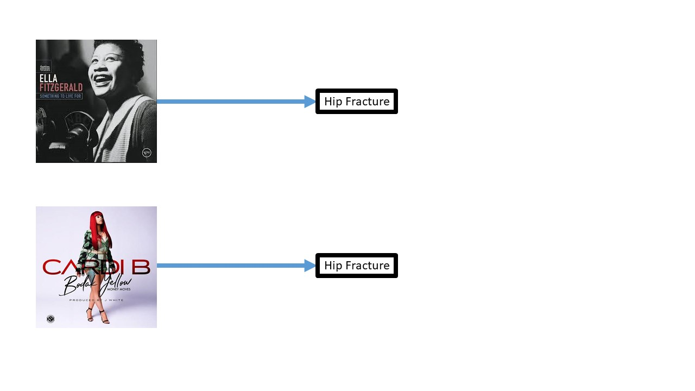

```{r xaringan-themer, include=FALSE}
# sds::duo_smith()
sds::mono_light_smith()
knitr::opts_chunk$set(echo=FALSE)
```


class: inverse

# Goals for this unit

### How to fit and interpret a linear regression model with multiple explanatory variables

### Understand how to use different explanatory variable types
  - *Binary* (differences in intercept)
  - *Quadratic/polynomial* (non-linearity)
  - *Interactions* (difference in slopes)
    
### Develop intuition and empirical tests for the best fitting model
  - Best combination of explanatory variables
    
### Interpret fit statistics and model summaries of multiple regression models

---
### Understanding relationships:
  - Simultaneously consider many factors in a relationship
  - Understand the relationship of the response and each explanatory variable separately (i.e., holding all these other predictors constant)
  
### Assessing differences
  - Can adjust for confounding factors
  - Estimate a more precise difference between groups
    
### Prediction:
  - We explain more of the variation in Y with more X 
  - Increased prediction accuracy (so the residuals are smaller)

---
## What's different: A Summary

## Equation

## **Degrees of Freedom:** $df=n-k-1$ not just $n-2$ 
  - Mean standard error (MSE)
  - t-statistics, p-values, confidence intervals
  - ANOVA table (Model, Residual, Total Sum of Squares)
      - $R^2$
      - Adjusted $R^2$
      

---
# What's different: the Regression Equation

### Simple Linear Regression: $Y= \beta_0 + \beta_1X + \epsilon$ where $\epsilon \sim  N(0,\sigma_\epsilon)$

### Multiple Linear Regression: $Y= \beta_0 + \beta_1X_1 + \beta_2X_2 + ... + \beta_kX_k + \epsilon$ where $\epsilon \sim  N(0,\sigma_\epsilon)$

---
## What's different: Degrees of Freedom - $n-k-1$

- Regression Standard Error : $\hat{\sigma}_\epsilon$
    - Simple Linear Regression: $\sqrt{\frac{\sum{(y - \hat{y})^2}}{n-2}}$ or $\sqrt{\frac{SSE}{n-2}}$
    - Multiple Linear Regression: $\sqrt{\frac{SSE}{n-k-1}}$
- p-values, Confidence Intervals
    - critical values (of $t$ or $t^*$) for p-values and CIs use $n-k-1$ degrees of freedom

---
## What's different: $R^2$ and Adjusted $R^2$

- Correlation
    - In SLR: with just two variables, square of their correlation $\rho$ -- $\rho^2$
    - In MLR: which correlation??
  
- ANOVA
  - $R^2 = 1 - \frac{SSE}{SSTotal}$
      - ** $R^2$ will *always* increase as you add additional variables to the model**
  - Adjusted $R^2$: $R^2_{adj} = 1-\frac{SSE/(n-k-1)}{SSTotal/(n-1)}$
  
---
## Going back to Simple Linear Regression

We have data ~30,000 adults from the National Health Interview Study (NHIS) via [IPUMS](www.ipums.org), the data repository you will use for your group project, to look at the relationship between weight (pounds) and height (inches).

```{r, echo=FALSE, fig.height=4, fig.width=6}
#install.packages("dagitty")
library(dagitty)
weight_slrdag<- dagitty('dag {
                  height [pos="1,1"]
                  weight [pos="3,1"]
                     height -> weight
                     }')
# coordinates(weight_slrdag)<-
#   list(x=c(height=1, weight=3), y=c(height=0, weight=0))
plot(weight_slrdag)
```

---
## SLR Output
```{r, message=FALSE, error=FALSE, warning=FALSE, echo=FALSE}
#vignette("value-labels", package = "ipumsr")
library(ipumsr)
library(magrittr)
library(tidyverse)
ddi <- read_ipums_ddi("nhis_00009.xml")
nhis <- read_ipums_micro(ddi, verbose = FALSE)

nhis_mlr<-nhis %>%
  filter((AGE>18 & AGE<100), (WEIGHT<900 & WEIGHT>0), (HEIGHT>0 & HEIGHT<90))
```

.pull-left[
```{r, echo=FALSE}
m0<-lm(WEIGHT~HEIGHT, data=nhis_mlr)
height_b<-as.numeric(coef(m0)[2])
height_lci<-confint(m0)[2,1]
height_uci<-confint(m0)[2,2]
```

$\beta_{height}:$ `r round(height_b, digits=2)`

$95\% \text{CI}_{height}:$ `r round(height_lci, digits=2)`, `r round(height_uci, digits=2)`

### How do we interpret the coefficient for height?

### How do we interpret the 95% CI for height?
]

.pull-right[
```{r, echo=FALSE, message=FALSE, error=FALSE, warning=FALSE}
ggplot(nhis_mlr, aes(x=HEIGHT, y=WEIGHT))+ geom_point(color="red", size=0.1) + geom_smooth(method = "lm", color="black") + theme_bw()
```
]

---
## Multiple Linear Regression - Output

We probably want to adjust for age, since it's a likely confounder. 
```{r, echo=FALSE, fig.height=4, fig.width=5}

weight_slrdag<- dagitty('dag {
                  height [pos="1,1"]
                  weight [pos="3,1"]
                  age [pos="0,1.5"]
                     height -> weight
                    age -> weight
                      age -> height
                     }')
# coordinates(weight_slrdag)<-
#   list(x=c(height=1, weight=3), y=c(height=0, weight=0))
plot(weight_slrdag)
```

---
# Multiple Linear Regression Output
```{r, echo=FALSE}
library(moderndive)
m1<-lm(WEIGHT~HEIGHT+AGE, data=nhis_mlr)
get_regression_table(m1)
```

### How do we interpret the coefficients for height?

### How do we interpret the 95% CI for height?

### What about Age?

---
## ANOVA Table
```{r, echo=FALSE}
anova(m1)
```

### What is the value of SSModel?

### What is the value of MSModel?

### What is the value of $R^2$ & Adjusted $R^2$ ?

---

```{r, message=FALSE, error=FALSE, warning=FALSE, echo=FALSE}
#install.packages("rgl")
library(rgl)
open3d()
weight<-nhis_mlr$WEIGHT
height<-nhis_mlr$HEIGHT
age<-nhis_mlr$AGE
fit<-lm(weight~height+age)
plot3d(height, age, weight, type = "s", col = "red", size = .5)

coefs <- coef(fit)
a <- coefs["height"]
b <- coefs["age"]
c <- -1
d <- coefs["(Intercept)"]
planes3d(a, b, c, d, alpha = 0.5)
rglwidget(width = 800, height = 600, reuse = FALSE)

```

---
## Is Drug Use Associated with Kaposi's Sarcoma?


---
## Is being an Ella Fitzgerald fan assocated with hip fracture?

---
class: inverse

### Find >5 confounding factors of the following associations:

```{r, echo=FALSE}
confoundingdag<- dagitty('dag {
                  gender [pos="1,1"]
                  income [pos="3,1"]
                  smoking [pos="1,2"]
                  lung_cancer [pos="3,2"]
                  major [pos="1,0"]
                  GPA [pos="3,0"]
                  height [pos="1,3"]
                  weight [pos="3,3"]
                    gender -> income
                    smoking -> lung_cancer
                    height -> weight
                    major -> GPA
                     }')
# coordinates(weight_slrdag)<-
#   list(x=c(height=1, weight=3), y=c(height=0, weight=0))
plot(confoundingdag)
```