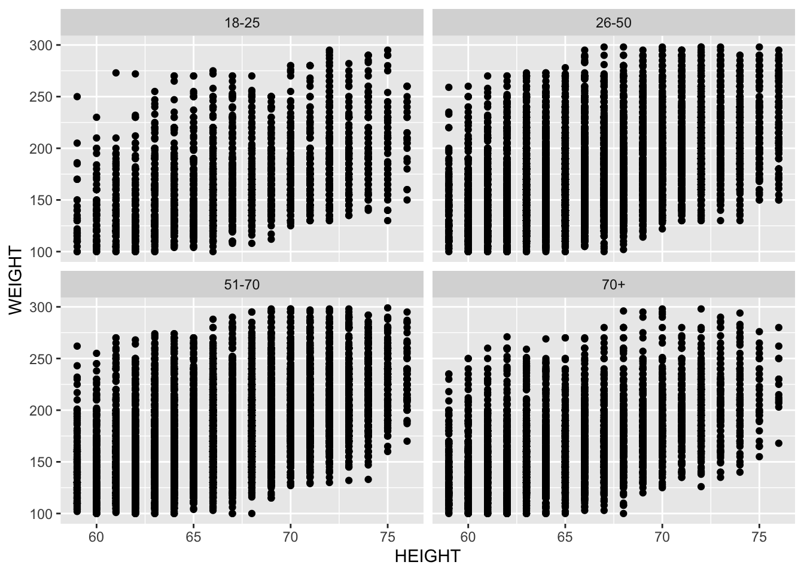

```r
knitr::opts_chunk$set(echo = TRUE)
setwd("~/Dropbox/3_Smith/SDS291/sds291_site/static/07")
#vignette("value-labels", package = "ipumsr")
library(ipumsr)
library(magrittr)
library(tidyverse)
ddi <- read_ipums_ddi("nhis_00009.xml")
nhis <- read_ipums_micro(ddi, verbose = FALSE)

nhis_mlr<-nhis %>%
  filter((AGE>18 & AGE<100), (WEIGHT<900 & WEIGHT>0), (HEIGHT>0 & HEIGHT<90)) %>%
  mutate(age_grp=as.factor(if_else(AGE %in% 18:25, "18-25",
                         if_else(AGE %in% 26:50, "26-50",
                         if_else(AGE %in% 51:70, "51-70",
                         if_else(AGE>70, "70+",NA_character_))))))
```

These are the data we used in Class 7 to illustrate the move from simple to multiple regression. They're data from NHIS: `WEIGHT` (Response), `HEIGHT` (Explanatory), & `AGE` (Interaction). I made age into categories for the purposes of the illustration.


# Using _Facets_ to make multiple panels

The documentation on facet wrapping within ggplot is [here](https://www.rdocumentation.org/packages/ggplot2/versions/3.3.0/topics/facet_wrap), and my go-to ggplot illustrative example site has an explanation [here.](http://www.sthda.com/english/wiki/ggplot2-facet-split-a-plot-into-a-matrix-of-panels)


```r
qplot(y=WEIGHT, x=HEIGHT, data=nhis_mlr) + facet_wrap(~age_grp)
```



See some more fun examples with Marvel characters [here](http://zevross.com/blog/2019/04/02/easy-multi-panel-plots-in-r-using-facet_wrap-and-facet_grid-from-ggplot2/).
