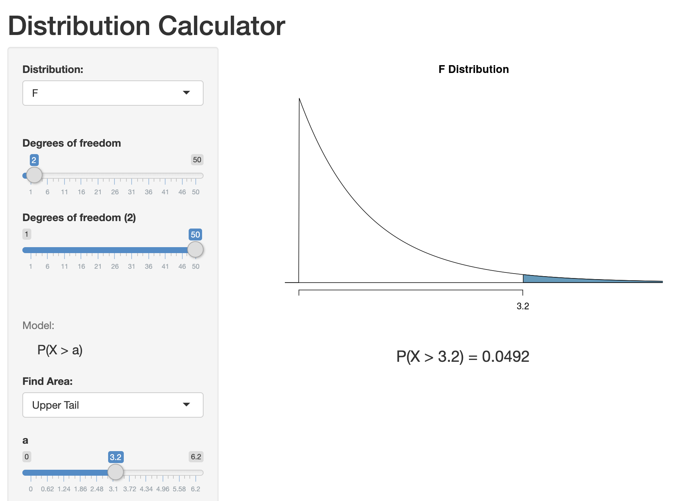

We're using data from a sample of 104 homes in Northampton, MA to see whether being close to the bike trail enhances the value of the home. Specifically, we're looking at the association between square feet (a house's size) and distance from the rail trail with the house's estimated value in 2014. The variables we're using are: 

- `Price2014`: Zillow price estimate from 2014 (in thousands of dollars)
- `Distance`: Distance (in miles) to the nearest entry point to the rail trail network
- `SquareFeet`: Square footage of interior finished space (in thousands of sf)

# Regression Output

```r
m1<-lm(Price2014 ~ SquareFeet + Distance , data = RailsTrails)
summary(m1)
```

```
## 
## Call:
## lm(formula = Price2014 ~ SquareFeet + Distance, data = RailsTrails)
## 
## Residuals:
##     Min      1Q  Median      3Q     Max 
## -152.15  -30.27   -4.14   25.75  337.93 
## 
## Coefficients:
##             Estimate Std. Error t value Pr(>|t|)    
## (Intercept)   78.985     25.607   3.085  0.00263 ** 
## SquareFeet   147.920     12.765  11.588  < 2e-16 ***
## Distance     -15.788      7.586  -2.081  0.03994 *  
## ---
## Signif. codes:  0 '***' 0.001 '**' 0.01 '*' 0.05 '.' 0.1 ' ' 1
## 
## Residual standard error: 65.55 on 101 degrees of freedom
## Multiple R-squared:  0.6574,	Adjusted R-squared:  0.6506 
## F-statistic: 96.89 on 2 and 101 DF,  p-value: < 2.2e-16
```

1. Write the fitted regression equation.

$$\widehat{price} = \hat\beta_0 + \hat\beta_1 SquareFeet + \hat\beta_2 Distance$$ 
or

$$\widehat{price} = 78.985 + (147.920 \cdot SquareFeet) + (-15.788 \cdot Distance)$$ 
2. Test the hypothesis that distance from the rail trail has a linear relationship with house price in 2014.

$H_0: \beta = 0$

$H_A: \beta \ne 0$

Since the t-statistic for the estimated relationship between distance and price (t=-2.081) is larger (i.e., more negative) the critical value $t^*$ ($t^*$=-1.96), and the corresponding p-value (p=0.03994) is below the 5% level (i.e., p<0.05), we can reject the null hypothesis and conclude that there is a significant linear relationship between distance to the rail trail and price of a house, adjusted for Square Feet. 

3. Calculate the 95% confidence interval for Distance to 3 decimal places (t* = 1.96) and interpret in a sentence.


```r
lci<-(-15.788+(1.96*7.586))
uci<-(-15.788-(1.96*7.586))
c(lci,uci)
```

```
## [1]  -0.91944 -30.65656
```

We are 95% confident that the true relationship between distance and house price is between \$919.44 and \$30,656.56 lower home price for each 1 mile distance further away from the rail trail, adjusted for house size.

4. What price would this model predict for a 1700 square foot house that it .986 miles from the rail trail? (Be cautious with the units)


```r
predicted<-(78.985 + (147.920*1.7) + (-15.788*0.96) )
predicted
```

```
## [1] 315.2925
```

The model would predict a house with 1700 square feet that is 0.986 miles from the rail trail would have a value of $315,292.50.

4. An actual house in this dataset that is 1700 square feet and .986 miles from the rail trail entrance had an Zillow price estimate of $222,864. Calculate the residual for this house and interpret it in a sentence in the context of this problem.


```r
actual<-222.864
actual - predicted
```

```
## [1] -92.42852
```

The residual for this particular home was \$-92,428.52 meaning the house had lower _actual_ price than the mdoel would have expected by \$92,482.52. In other words, the model overestimtated the price of this particular house.

\newpage
# Residuals and Model Error


```r
anova(m1)
```

```
## Analysis of Variance Table
## 
## Response: Price2014
##             Df Sum Sq Mean Sq  F value  Pr(>F)    
## SquareFeet   1 813976  813976 189.4454 < 2e-16 ***
## Distance     1  18611   18611   4.3316 0.03994 *  
## Residuals  101 433959    4297                     
## ---
## Signif. codes:  0 '***' 0.001 '**' 0.01 '*' 0.05 '.' 0.1 ' ' 1
```

1. Calculate the $R^2$ (same equation as simple linear regression, p.103-104) and Adjusted $R^2$ for the model (see p.105 for the equation). Interpret each in a sentence.

$$ R^2 = 1 - \frac{SSError}{SSTotal} $$
and 

$$ AdjR^2 = 1 - \frac{\frac{SSError}{n-k-1}}{\frac{SSTotal}{n-1}} $$

```r
SSE<- 433959
SST<- 813976+18611+433959
SSM<- 813976+18611

RSq<- 1- (SSE/SST)
RSq
```

```
## [1] 0.6573681
```

```r
n<- nrow(RailsTrails)
k<-2
AdjRSq<- 1- ( (SSE / (n-k-1)) / ( SST / (n-1)) )
AdjRSq
```

```
## [1] 0.6505834
```

65.74% of the variation in house prices explained by the model, as reflected by $R^2$. Adjusted $R^2$ takes into account how many explanatory variables there are in the model, and its value suggests that 65.05% of the variation in house prices is explained by this model. Adjusted $R^2$ is useful for comparing across models, especially as the number of explanatory variables change between models, and is the better measure to use in multiple regression.

1. Calculate the regression standard error for this model (p.99) and interepret it in a sentence.


```r
library(broom)
m1_data<-augment(m1)

SSE <- sum((m1_data$.resid)^2)
SSE
```

```
## [1] 433959.5
```

```r
RSE<-sqrt(SSE/(n-k-1))
RSE
```

```
## [1] 65.54867
```

The average amount of error in the model is 65.55; in other words, the model's estimates of a home's price is off by \$65,548.67.

1. Calculate the F statistic for the model: $F = \frac{MSModel}{MSError}$ (see p.102 for making sense of the ANOVA table)


```r
MSM<-SSM/k
MSE<-SSE/(n-k-1)
FStat<-MSM/MSE
FStat
```

```
## [1] 96.88841
```


1. State the null and alternative hypotheses for the F test (see p.102). Look at the F Distribution calculator (at https://gallery.shinyapps.io/dist_calc/) and estimate the p-value for your F statistic with the degrees of freedom above (it will be an approximation - the slider bars won't go as high as you need them to - but it gives you the rough answer for your hypothesis). What do you conclude about your hypothesis?



$H_0: \beta_1=\beta_2=0$

$H_A: \beta_1=\beta_2 \ne 0$

Given that our FStatistic (96.88) is much larger than the critical value of 3.2, the pvalue should be much smaller than 0.05. From the summary output we see that an F(2,102)=96.88, p<0.001. Thus, we could reject the null hypothesis that the model ($\hat\beta_1$ and $\hat\beta_2$) explains none of the variation in the house prices and conclude that the model overall does explain a significant amount of variation in house prices.
