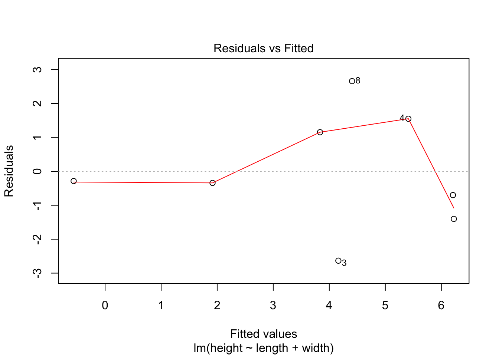

<table class="table" style="margin-left: auto; margin-right: auto;">
 <thead>
  <tr>
   <th style="text-align:right;"> marshmallow </th>
   <th style="text-align:right;"> height </th>
   <th style="text-align:right;"> length </th>
   <th style="text-align:right;"> width </th>
  </tr>
 </thead>
<tbody>
  <tr>
   <td style="text-align:right;"> 1 </td>
   <td style="text-align:right;"> -0.8 </td>
   <td style="text-align:right;"> 1.5 </td>
   <td style="text-align:right;"> 3.6 </td>
  </tr>
  <tr>
   <td style="text-align:right;"> 2 </td>
   <td style="text-align:right;"> 5.0 </td>
   <td style="text-align:right;"> 2.4 </td>
   <td style="text-align:right;"> 2.3 </td>
  </tr>
  <tr>
   <td style="text-align:right;"> 3 </td>
   <td style="text-align:right;"> 1.5 </td>
   <td style="text-align:right;"> 3.3 </td>
   <td style="text-align:right;"> 3.5 </td>
  </tr>
  <tr>
   <td style="text-align:right;"> 4 </td>
   <td style="text-align:right;"> 7.0 </td>
   <td style="text-align:right;"> 3.3 </td>
   <td style="text-align:right;"> 2.7 </td>
  </tr>
  <tr>
   <td style="text-align:right;"> 5 </td>
   <td style="text-align:right;"> 1.6 </td>
   <td style="text-align:right;"> 1.8 </td>
   <td style="text-align:right;"> 2.5 </td>
  </tr>
  <tr>
   <td style="text-align:right;"> 6 </td>
   <td style="text-align:right;"> 5.5 </td>
   <td style="text-align:right;"> 3.0 </td>
   <td style="text-align:right;"> 1.8 </td>
  </tr>
  <tr>
   <td style="text-align:right;"> 7 </td>
   <td style="text-align:right;"> 4.8 </td>
   <td style="text-align:right;"> 3.9 </td>
   <td style="text-align:right;"> 3.2 </td>
  </tr>
  <tr>
   <td style="text-align:right;"> 8 </td>
   <td style="text-align:right;"> 7.1 </td>
   <td style="text-align:right;"> 3.5 </td>
   <td style="text-align:right;"> 3.8 </td>
  </tr>
</tbody>
</table>

# Plot the data points.

Use the variable names literally -- let one edge of the brownie be the axis for length, the other the width, and y is the height (how where on the toothpick the marshmallow should go).

What are the range of units of length and width? Of Height?  Use these ranges thoughtfully in the next step.

1. Either put the marshmallows on fist and then put the toothpick where it should be for its values of width and length; or do the opposite order (place all toothpicks, then put marshmallows on)

# Imagine where the regression line would go?

1. Describe the relationship between x1 and y. Is the slope positive or negative, steep or shallow?

1. Describe the relationship between x2 and y. Is the slope positive or negative, steep or shallow?

# Fit the regression plane

1. Tear off a rectangle of parchment paper roughly the size of the brownie.

1. Put it through the toothpicks -- ie, poke holes through the paper -- so it best fits the data points (best = mean zero of the residuals).

You may have to move and replace some marshmallows...

# Visualize what "controlling for" means


```
## glX 
##   1
```

<!--html_preserve--><div id="rgl38838" style="width:1000px;height:1000px;" class="rglWebGL html-widget"></div>
<script type="application/json" data-for="rgl38838">{"x":{"material":{"color":"#000000","alpha":1,"lit":true,"ambient":"#000000","specular":"#FFFFFF","emission":"#000000","shininess":50,"smooth":true,"front":"filled","back":"filled","size":3,"lwd":1,"fog":false,"point_antialias":false,"line_antialias":false,"texture":null,"textype":"rgb","texmipmap":false,"texminfilter":"linear","texmagfilter":"linear","texenvmap":false,"depth_mask":true,"depth_test":"less","isTransparent":false,"polygon_offset":[0,0]},"rootSubscene":1,"objects":{"7":{"id":7,"type":"spheres","material":{},"vertices":[[1.47845089435577,3.56996846199036,-0.846484482288361],[2.43456506729126,2.33548045158386,4.98825073242188],[3.29439616203308,3.51469755172729,1.52946448326111],[3.30906295776367,2.74995064735413,6.96124410629272],[1.80564546585083,2.53285336494446,1.57635426521301],[3.0191376209259,1.78050446510315,5.5064582824707],[3.93637228012085,3.24845719337463,4.82031917572021],[3.53898096084595,3.75466132164001,7.06630802154541]],"colors":[[1,0,0,1]],"radii":[[0.0409807302057743]],"centers":[[1.47845089435577,3.56996846199036,-0.846484482288361],[2.43456506729126,2.33548045158386,4.98825073242188],[3.29439616203308,3.51469755172729,1.52946448326111],[3.30906295776367,2.74995064735413,6.96124410629272],[1.80564546585083,2.53285336494446,1.57635426521301],[3.0191376209259,1.78050446510315,5.5064582824707],[3.93637228012085,3.24845719337463,4.82031917572021],[3.53898096084595,3.75466132164001,7.06630802154541]],"ignoreExtent":false,"flags":3},"9":{"id":9,"type":"text","material":{"lit":false},"vertices":[[2.70741176605225,1.42385649681091,-2.2759964466095]],"colors":[[0,0,0,1]],"texts":[["length"]],"cex":[[1]],"adj":[[0.5,0.5]],"centers":[[2.70741176605225,1.42385649681091,-2.2759964466095]],"family":[["sans"]],"font":[[1]],"ignoreExtent":true,"flags":2064},"10":{"id":10,"type":"text","material":{"lit":false},"vertices":[[1.03440690040588,2.76758289337158,-2.2759964466095]],"colors":[[0,0,0,1]],"texts":[["width"]],"cex":[[1]],"adj":[[0.5,0.5]],"centers":[[1.03440690040588,2.76758289337158,-2.2759964466095]],"family":[["sans"]],"font":[[1]],"ignoreExtent":true,"flags":2064},"11":{"id":11,"type":"text","material":{"lit":false},"vertices":[[1.03440690040588,1.42385649681091,3.10991168022156]],"colors":[[0,0,0,1]],"texts":[["height"]],"cex":[[1]],"adj":[[0.5,0.5]],"centers":[[1.03440690040588,1.42385649681091,3.10991168022156]],"family":[["sans"]],"font":[[1]],"ignoreExtent":true,"flags":2064},"12":{"id":12,"type":"planes","material":{"alpha":0.498039215803146,"isTransparent":true},"vertices":[[1.45796823501587,1.76405310630798,2.24733185768127],[1.45796823501587,3.75886654853821,-0.912424445152283],[1.46556663513184,3.77111268043518,-0.912424445152283]],"normals":[[2.5528666973114,-1.58398592472076,-1]],"colors":[[0,0,0,0.498039215803146]],"offsets":[[1.3195686340332]],"centers":[[1.46050107479095,3.09801077842712,0.140827655792236],[2.29346346855164,3.10209274291992,2.26080346107483],[3.12389278411865,2.74755573272705,4.94236087799072],[2.92876482009888,2.07853603363037,5.50394248962402]],"ignoreExtent":true,"flags":35},"5":{"id":5,"type":"light","vertices":[[0,0,1]],"colors":[[1,1,1,1],[1,1,1,1],[1,1,1,1]],"viewpoint":true,"finite":false},"4":{"id":4,"type":"background","material":{"fog":true},"colors":[[0.298039227724075,0.298039227724075,0.298039227724075,1]],"centers":[[0,0,0]],"sphere":false,"fogtype":"none","flags":0},"6":{"id":6,"type":"background","material":{"lit":false,"back":"lines"},"colors":[[1,1,1,1]],"centers":[[0,0,0]],"sphere":false,"fogtype":"none","flags":0},"8":{"id":8,"type":"bboxdeco","material":{"front":"lines","back":"lines"},"vertices":[[1.5,"NA","NA"],[2,"NA","NA"],[2.5,"NA","NA"],[3,"NA","NA"],[3.5,"NA","NA"],["NA",2,"NA"],["NA",2.5,"NA"],["NA",3,"NA"],["NA",3.5,"NA"],["NA","NA",0],["NA","NA",2],["NA","NA",4],["NA","NA",6]],"colors":[[0,0,0,1]],"draw_front":true,"newIds":[20,21,22,23,24,25,26]},"1":{"id":1,"type":"subscene","par3d":{"antialias":16,"FOV":30,"ignoreExtent":false,"listeners":1,"mouseMode":{"left":"trackball","right":"zoom","middle":"fov","wheel":"pull"},"observer":[0,0,21.1902618408203],"modelMatrix":[[2.00075054168701,0,0,-5.4168553352356],[0,0.85198312997818,0.58400559425354,-4.17413997650146],[0,-2.3408043384552,0.212560653686523,-15.3729362487793],[0,0,0,1]],"projMatrix":[[3.73205089569092,0,0,0],[0,3.73205089569092,0,0],[0,0,-3.86370301246643,-76.3884353637695],[0,0,-1,0]],"skipRedraw":false,"userMatrix":[[1,0,0,0],[0,0.342020143325668,0.939692620785909,0],[0,-0.939692620785909,0.342020143325668,0],[0,0,0,1]],"userProjection":[[1,0,0,0],[0,1,0,0],[0,0,1,0],[0,0,0,1]],"scale":[2.00075054168701,2.49103188514709,0.621485769748688],"viewport":{"x":0,"y":0,"width":1,"height":1},"zoom":1,"bbox":[1.45796823501587,3.95685505867004,1.76405310630798,3.77111268043518,-0.912424445152283,7.13224792480469],"windowRect":[0,45,256,301],"family":"sans","font":1,"cex":1,"useFreeType":true,"fontname":"/Library/Frameworks/R.framework/Versions/3.6/Resources/library/rgl/fonts/FreeSans.ttf","maxClipPlanes":6,"glVersion":2.09999990463257,"activeSubscene":0},"embeddings":{"viewport":"replace","projection":"replace","model":"replace","mouse":"replace"},"objects":[6,8,7,9,10,11,12,5,20,21,22,23,24,25,26],"subscenes":[],"flags":2675},"20":{"id":20,"type":"lines","material":{"lit":false},"vertices":[[1.5,1.7339471578598,-1.03309452533722],[3.5,1.7339471578598,-1.03309452533722],[1.5,1.7339471578598,-1.03309452533722],[1.5,1.68226540088654,-1.24024486541748],[2,1.7339471578598,-1.03309452533722],[2,1.68226540088654,-1.24024486541748],[2.5,1.7339471578598,-1.03309452533722],[2.5,1.68226540088654,-1.24024486541748],[3,1.7339471578598,-1.03309452533722],[3,1.68226540088654,-1.24024486541748],[3.5,1.7339471578598,-1.03309452533722],[3.5,1.68226540088654,-1.24024486541748]],"colors":[[0,0,0,1]],"centers":[[2.5,1.7339471578598,-1.03309452533722],[1.5,1.70810627937317,-1.13666963577271],[2,1.70810627937317,-1.13666963577271],[2.5,1.70810627937317,-1.13666963577271],[3,1.70810627937317,-1.13666963577271],[3.5,1.70810627937317,-1.13666963577271]],"ignoreExtent":true,"origId":8,"flags":64},"21":{"id":21,"type":"text","material":{"lit":false},"vertices":[[1.5,1.57890188694,-1.65454542636871],[2,1.57890188694,-1.65454542636871],[2.5,1.57890188694,-1.65454542636871],[3,1.57890188694,-1.65454542636871],[3.5,1.57890188694,-1.65454542636871]],"colors":[[0,0,0,1]],"texts":[["1.5"],["2"],["2.5"],["3"],["3.5"]],"cex":[[1]],"adj":[[0.5,0.5]],"centers":[[1.5,1.57890188694,-1.65454542636871],[2,1.57890188694,-1.65454542636871],[2.5,1.57890188694,-1.65454542636871],[3,1.57890188694,-1.65454542636871],[3.5,1.57890188694,-1.65454542636871]],"family":[["sans"]],"font":[[1]],"ignoreExtent":true,"origId":8,"flags":2064},"22":{"id":22,"type":"lines","material":{"lit":false},"vertices":[[1.42048490047455,2,-1.03309452533722],[1.42048490047455,3.5,-1.03309452533722],[1.42048490047455,2,-1.03309452533722],[1.35613858699799,2,-1.24024486541748],[1.42048490047455,2.5,-1.03309452533722],[1.35613858699799,2.5,-1.24024486541748],[1.42048490047455,3,-1.03309452533722],[1.35613858699799,3,-1.24024486541748],[1.42048490047455,3.5,-1.03309452533722],[1.35613858699799,3.5,-1.24024486541748]],"colors":[[0,0,0,1]],"centers":[[1.42048490047455,2.75,-1.03309452533722],[1.38831174373627,2,-1.13666963577271],[1.38831174373627,2.5,-1.13666963577271],[1.38831174373627,3,-1.13666963577271],[1.38831174373627,3.5,-1.13666963577271]],"ignoreExtent":true,"origId":8,"flags":64},"23":{"id":23,"type":"text","material":{"lit":false},"vertices":[[1.22744596004486,2,-1.65454542636871],[1.22744596004486,2.5,-1.65454542636871],[1.22744596004486,3,-1.65454542636871],[1.22744596004486,3.5,-1.65454542636871]],"colors":[[0,0,0,1]],"texts":[["2"],["2.5"],["3"],["3.5"]],"cex":[[1]],"adj":[[0.5,0.5]],"centers":[[1.22744596004486,2,-1.65454542636871],[1.22744596004486,2.5,-1.65454542636871],[1.22744596004486,3,-1.65454542636871],[1.22744596004486,3.5,-1.65454542636871]],"family":[["sans"]],"font":[[1]],"ignoreExtent":true,"origId":8,"flags":2064},"24":{"id":24,"type":"lines","material":{"lit":false},"vertices":[[1.42048490047455,1.7339471578598,0],[1.42048490047455,1.7339471578598,6],[1.42048490047455,1.7339471578598,0],[1.35613858699799,1.68226540088654,0],[1.42048490047455,1.7339471578598,2],[1.35613858699799,1.68226540088654,2],[1.42048490047455,1.7339471578598,4],[1.35613858699799,1.68226540088654,4],[1.42048490047455,1.7339471578598,6],[1.35613858699799,1.68226540088654,6]],"colors":[[0,0,0,1]],"centers":[[1.42048490047455,1.7339471578598,3],[1.38831174373627,1.70810627937317,0],[1.38831174373627,1.70810627937317,2],[1.38831174373627,1.70810627937317,4],[1.38831174373627,1.70810627937317,6]],"ignoreExtent":true,"origId":8,"flags":64},"25":{"id":25,"type":"text","material":{"lit":false},"vertices":[[1.22744596004486,1.57890188694,0],[1.22744596004486,1.57890188694,2],[1.22744596004486,1.57890188694,4],[1.22744596004486,1.57890188694,6]],"colors":[[0,0,0,1]],"texts":[["0"],["2"],["4"],["6"]],"cex":[[1]],"adj":[[0.5,0.5]],"centers":[[1.22744596004486,1.57890188694,0],[1.22744596004486,1.57890188694,2],[1.22744596004486,1.57890188694,4],[1.22744596004486,1.57890188694,6]],"family":[["sans"]],"font":[[1]],"ignoreExtent":true,"origId":8,"flags":2064},"26":{"id":26,"type":"lines","material":{"lit":false},"vertices":[[1.42048490047455,1.7339471578598,-1.03309452533722],[1.42048490047455,3.80121850967407,-1.03309452533722],[1.42048490047455,1.7339471578598,7.2529182434082],[1.42048490047455,3.80121850967407,7.2529182434082],[1.42048490047455,1.7339471578598,-1.03309452533722],[1.42048490047455,1.7339471578598,7.2529182434082],[1.42048490047455,3.80121850967407,-1.03309452533722],[1.42048490047455,3.80121850967407,7.2529182434082],[1.42048490047455,1.7339471578598,-1.03309452533722],[3.99433827400208,1.7339471578598,-1.03309452533722],[1.42048490047455,1.7339471578598,7.2529182434082],[3.99433827400208,1.7339471578598,7.2529182434082],[1.42048490047455,3.80121850967407,-1.03309452533722],[3.99433827400208,3.80121850967407,-1.03309452533722],[1.42048490047455,3.80121850967407,7.2529182434082],[3.99433827400208,3.80121850967407,7.2529182434082],[3.99433827400208,1.7339471578598,-1.03309452533722],[3.99433827400208,3.80121850967407,-1.03309452533722],[3.99433827400208,1.7339471578598,7.2529182434082],[3.99433827400208,3.80121850967407,7.2529182434082],[3.99433827400208,1.7339471578598,-1.03309452533722],[3.99433827400208,1.7339471578598,7.2529182434082],[3.99433827400208,3.80121850967407,-1.03309452533722],[3.99433827400208,3.80121850967407,7.2529182434082]],"colors":[[0,0,0,1]],"centers":[[1.42048490047455,2.76758289337158,-1.03309452533722],[1.42048490047455,2.76758289337158,7.2529182434082],[1.42048490047455,1.7339471578598,3.10991191864014],[1.42048490047455,3.80121850967407,3.10991191864014],[2.70741152763367,1.7339471578598,-1.03309452533722],[2.70741152763367,1.7339471578598,7.2529182434082],[2.70741152763367,3.80121850967407,-1.03309452533722],[2.70741152763367,3.80121850967407,7.2529182434082],[3.99433827400208,2.76758289337158,-1.03309452533722],[3.99433827400208,2.76758289337158,7.2529182434082],[3.99433827400208,1.7339471578598,3.10991191864014],[3.99433827400208,3.80121850967407,3.10991191864014]],"ignoreExtent":true,"origId":8,"flags":64},"33":{"id":33,"type":"linestrip","material":{"alpha":0.498039215803146,"lit":false,"depth_test":"always","isTransparent":true},"vertices":[[0,0,-0.999000012874603],[1,0,-0.999000012874603],[1,1,-0.999000012874603],[0,1,-0.999000012874603],[0,0,-0.999000012874603]],"colors":[[0,0,0,0.498039215803146]],"centers":[[0,0,-0.999000012874603],[1,0,-0.999000012874603],[1,1,-0.999000012874603],[0,1,-0.999000012874603],[0,0,-0.999000012874603]],"ignoreExtent":false,"flags":32864}},"crosstalk":{"key":[null],"group":"","id":0,"options":[null]},"width":1000,"height":1000,"brushId":33,"sphereVerts":{"vb":[[0,0,0,0,0,0,0,0,0,0,0,0,0,0,0,0,0,0,0.0746578340503426,0.146446609406726,0.212607523691814,0.270598050073098,0.318189645143208,0.353553390593274,0.375330277517865,0.38268343236509,0.375330277517865,0.353553390593274,0.318189645143208,0.270598050073098,0.212607523691814,0.146446609406726,0.0746578340503426,0,0,0.137949689641471,0.270598050073098,0.392847479193551,0.5,0.587937801209679,0.653281482438188,0.693519922661074,0.707106781186547,0.693519922661074,0.653281482438188,0.587937801209679,0.5,0.392847479193551,0.270598050073098,0.137949689641471,0,0,0.180239955501737,0.353553390593274,0.513279967159337,0.653281482438188,0.768177756711416,0.853553390593274,0.906127446352888,0.923879532511287,0.906127446352888,0.853553390593274,0.768177756711416,0.653281482438188,0.513279967159337,0.353553390593274,0.180239955501737,0,0,0.195090322016128,0.38268343236509,0.555570233019602,0.707106781186547,0.831469612302545,0.923879532511287,0.98078528040323,1,0.98078528040323,0.923879532511287,0.831469612302545,0.707106781186547,0.555570233019602,0.38268343236509,0.195090322016128,0,0,0.180239955501737,0.353553390593274,0.513279967159337,0.653281482438188,0.768177756711416,0.853553390593274,0.906127446352888,0.923879532511287,0.906127446352888,0.853553390593274,0.768177756711416,0.653281482438188,0.513279967159337,0.353553390593274,0.180239955501737,0,0,0.137949689641471,0.270598050073098,0.392847479193551,0.5,0.587937801209679,0.653281482438188,0.693519922661074,0.707106781186547,0.693519922661074,0.653281482438188,0.587937801209679,0.5,0.392847479193551,0.270598050073098,0.137949689641471,0,0,0.0746578340503426,0.146446609406726,0.212607523691814,0.270598050073098,0.318189645143208,0.353553390593274,0.375330277517865,0.38268343236509,0.375330277517865,0.353553390593274,0.318189645143208,0.270598050073098,0.212607523691814,0.146446609406726,0.0746578340503426,0,0,0,0,0,0,0,0,0,0,0,0,0,0,0,0,0,0,-0,-0.0746578340503426,-0.146446609406726,-0.212607523691814,-0.270598050073098,-0.318189645143208,-0.353553390593274,-0.375330277517865,-0.38268343236509,-0.375330277517865,-0.353553390593274,-0.318189645143208,-0.270598050073098,-0.212607523691814,-0.146446609406726,-0.0746578340503426,-0,-0,-0.137949689641471,-0.270598050073098,-0.392847479193551,-0.5,-0.587937801209679,-0.653281482438188,-0.693519922661074,-0.707106781186547,-0.693519922661074,-0.653281482438188,-0.587937801209679,-0.5,-0.392847479193551,-0.270598050073098,-0.137949689641471,-0,-0,-0.180239955501737,-0.353553390593274,-0.513279967159337,-0.653281482438188,-0.768177756711416,-0.853553390593274,-0.906127446352888,-0.923879532511287,-0.906127446352888,-0.853553390593274,-0.768177756711416,-0.653281482438188,-0.513279967159337,-0.353553390593274,-0.180239955501737,-0,-0,-0.195090322016128,-0.38268343236509,-0.555570233019602,-0.707106781186547,-0.831469612302545,-0.923879532511287,-0.98078528040323,-1,-0.98078528040323,-0.923879532511287,-0.831469612302545,-0.707106781186547,-0.555570233019602,-0.38268343236509,-0.195090322016128,-0,-0,-0.180239955501737,-0.353553390593274,-0.513279967159337,-0.653281482438188,-0.768177756711416,-0.853553390593274,-0.906127446352888,-0.923879532511287,-0.906127446352888,-0.853553390593274,-0.768177756711416,-0.653281482438188,-0.513279967159337,-0.353553390593274,-0.180239955501737,-0,-0,-0.137949689641471,-0.270598050073098,-0.392847479193551,-0.5,-0.587937801209679,-0.653281482438188,-0.693519922661074,-0.707106781186547,-0.693519922661074,-0.653281482438188,-0.587937801209679,-0.5,-0.392847479193551,-0.270598050073098,-0.137949689641471,-0,-0,-0.0746578340503426,-0.146446609406726,-0.212607523691814,-0.270598050073098,-0.318189645143208,-0.353553390593274,-0.375330277517865,-0.38268343236509,-0.375330277517865,-0.353553390593274,-0.318189645143208,-0.270598050073098,-0.212607523691814,-0.146446609406726,-0.0746578340503426,-0,0,0,0,0,0,0,0,0,0,0,0,0,0,0,0,0,0],[-1,-0.98078528040323,-0.923879532511287,-0.831469612302545,-0.707106781186547,-0.555570233019602,-0.38268343236509,-0.195090322016128,0,0.195090322016128,0.38268343236509,0.555570233019602,0.707106781186547,0.831469612302545,0.923879532511287,0.98078528040323,1,-1,-0.98078528040323,-0.923879532511287,-0.831469612302545,-0.707106781186547,-0.555570233019602,-0.38268343236509,-0.195090322016128,0,0.195090322016128,0.38268343236509,0.555570233019602,0.707106781186547,0.831469612302545,0.923879532511287,0.98078528040323,1,-1,-0.98078528040323,-0.923879532511287,-0.831469612302545,-0.707106781186547,-0.555570233019602,-0.38268343236509,-0.195090322016128,0,0.195090322016128,0.38268343236509,0.555570233019602,0.707106781186547,0.831469612302545,0.923879532511287,0.98078528040323,1,-1,-0.98078528040323,-0.923879532511287,-0.831469612302545,-0.707106781186547,-0.555570233019602,-0.38268343236509,-0.195090322016128,0,0.195090322016128,0.38268343236509,0.555570233019602,0.707106781186547,0.831469612302545,0.923879532511287,0.98078528040323,1,-1,-0.98078528040323,-0.923879532511287,-0.831469612302545,-0.707106781186547,-0.555570233019602,-0.38268343236509,-0.195090322016128,0,0.195090322016128,0.38268343236509,0.555570233019602,0.707106781186547,0.831469612302545,0.923879532511287,0.98078528040323,1,-1,-0.98078528040323,-0.923879532511287,-0.831469612302545,-0.707106781186547,-0.555570233019602,-0.38268343236509,-0.195090322016128,0,0.195090322016128,0.38268343236509,0.555570233019602,0.707106781186547,0.831469612302545,0.923879532511287,0.98078528040323,1,-1,-0.98078528040323,-0.923879532511287,-0.831469612302545,-0.707106781186547,-0.555570233019602,-0.38268343236509,-0.195090322016128,0,0.195090322016128,0.38268343236509,0.555570233019602,0.707106781186547,0.831469612302545,0.923879532511287,0.98078528040323,1,-1,-0.98078528040323,-0.923879532511287,-0.831469612302545,-0.707106781186547,-0.555570233019602,-0.38268343236509,-0.195090322016128,0,0.195090322016128,0.38268343236509,0.555570233019602,0.707106781186547,0.831469612302545,0.923879532511287,0.98078528040323,1,-1,-0.98078528040323,-0.923879532511287,-0.831469612302545,-0.707106781186547,-0.555570233019602,-0.38268343236509,-0.195090322016128,0,0.195090322016128,0.38268343236509,0.555570233019602,0.707106781186547,0.831469612302545,0.923879532511287,0.98078528040323,1,-1,-0.98078528040323,-0.923879532511287,-0.831469612302545,-0.707106781186547,-0.555570233019602,-0.38268343236509,-0.195090322016128,0,0.195090322016128,0.38268343236509,0.555570233019602,0.707106781186547,0.831469612302545,0.923879532511287,0.98078528040323,1,-1,-0.98078528040323,-0.923879532511287,-0.831469612302545,-0.707106781186547,-0.555570233019602,-0.38268343236509,-0.195090322016128,0,0.195090322016128,0.38268343236509,0.555570233019602,0.707106781186547,0.831469612302545,0.923879532511287,0.98078528040323,1,-1,-0.98078528040323,-0.923879532511287,-0.831469612302545,-0.707106781186547,-0.555570233019602,-0.38268343236509,-0.195090322016128,0,0.195090322016128,0.38268343236509,0.555570233019602,0.707106781186547,0.831469612302545,0.923879532511287,0.98078528040323,1,-1,-0.98078528040323,-0.923879532511287,-0.831469612302545,-0.707106781186547,-0.555570233019602,-0.38268343236509,-0.195090322016128,0,0.195090322016128,0.38268343236509,0.555570233019602,0.707106781186547,0.831469612302545,0.923879532511287,0.98078528040323,1,-1,-0.98078528040323,-0.923879532511287,-0.831469612302545,-0.707106781186547,-0.555570233019602,-0.38268343236509,-0.195090322016128,0,0.195090322016128,0.38268343236509,0.555570233019602,0.707106781186547,0.831469612302545,0.923879532511287,0.98078528040323,1,-1,-0.98078528040323,-0.923879532511287,-0.831469612302545,-0.707106781186547,-0.555570233019602,-0.38268343236509,-0.195090322016128,0,0.195090322016128,0.38268343236509,0.555570233019602,0.707106781186547,0.831469612302545,0.923879532511287,0.98078528040323,1,-1,-0.98078528040323,-0.923879532511287,-0.831469612302545,-0.707106781186547,-0.555570233019602,-0.38268343236509,-0.195090322016128,0,0.195090322016128,0.38268343236509,0.555570233019602,0.707106781186547,0.831469612302545,0.923879532511287,0.98078528040323,1,-1,-0.98078528040323,-0.923879532511287,-0.831469612302545,-0.707106781186547,-0.555570233019602,-0.38268343236509,-0.195090322016128,0,0.195090322016128,0.38268343236509,0.555570233019602,0.707106781186547,0.831469612302545,0.923879532511287,0.98078528040323,1],[0,0.195090322016128,0.38268343236509,0.555570233019602,0.707106781186547,0.831469612302545,0.923879532511287,0.98078528040323,1,0.98078528040323,0.923879532511287,0.831469612302545,0.707106781186547,0.555570233019602,0.38268343236509,0.195090322016128,0,0,0.180239955501737,0.353553390593274,0.513279967159337,0.653281482438188,0.768177756711416,0.853553390593274,0.906127446352888,0.923879532511287,0.906127446352888,0.853553390593274,0.768177756711416,0.653281482438188,0.513279967159337,0.353553390593274,0.180239955501737,0,0,0.137949689641471,0.270598050073098,0.392847479193551,0.5,0.587937801209679,0.653281482438188,0.693519922661074,0.707106781186547,0.693519922661074,0.653281482438188,0.587937801209679,0.5,0.392847479193551,0.270598050073098,0.137949689641471,0,0,0.0746578340503426,0.146446609406726,0.212607523691814,0.270598050073098,0.318189645143208,0.353553390593274,0.375330277517865,0.38268343236509,0.375330277517865,0.353553390593274,0.318189645143208,0.270598050073098,0.212607523691814,0.146446609406726,0.0746578340503426,0,0,0,0,0,0,0,0,0,0,0,0,0,0,0,0,0,0,-0,-0.0746578340503426,-0.146446609406726,-0.212607523691814,-0.270598050073098,-0.318189645143208,-0.353553390593274,-0.375330277517865,-0.38268343236509,-0.375330277517865,-0.353553390593274,-0.318189645143208,-0.270598050073098,-0.212607523691814,-0.146446609406726,-0.0746578340503426,-0,-0,-0.137949689641471,-0.270598050073098,-0.392847479193551,-0.5,-0.587937801209679,-0.653281482438188,-0.693519922661074,-0.707106781186547,-0.693519922661074,-0.653281482438188,-0.587937801209679,-0.5,-0.392847479193551,-0.270598050073098,-0.137949689641471,-0,-0,-0.180239955501737,-0.353553390593274,-0.513279967159337,-0.653281482438188,-0.768177756711416,-0.853553390593274,-0.906127446352888,-0.923879532511287,-0.906127446352888,-0.853553390593274,-0.768177756711416,-0.653281482438188,-0.513279967159337,-0.353553390593274,-0.180239955501737,-0,-0,-0.195090322016128,-0.38268343236509,-0.555570233019602,-0.707106781186547,-0.831469612302545,-0.923879532511287,-0.98078528040323,-1,-0.98078528040323,-0.923879532511287,-0.831469612302545,-0.707106781186547,-0.555570233019602,-0.38268343236509,-0.195090322016128,-0,-0,-0.180239955501737,-0.353553390593274,-0.513279967159337,-0.653281482438188,-0.768177756711416,-0.853553390593274,-0.906127446352888,-0.923879532511287,-0.906127446352888,-0.853553390593274,-0.768177756711416,-0.653281482438188,-0.513279967159337,-0.353553390593274,-0.180239955501737,-0,-0,-0.137949689641471,-0.270598050073098,-0.392847479193551,-0.5,-0.587937801209679,-0.653281482438188,-0.693519922661074,-0.707106781186547,-0.693519922661074,-0.653281482438188,-0.587937801209679,-0.5,-0.392847479193551,-0.270598050073098,-0.137949689641471,-0,-0,-0.0746578340503426,-0.146446609406726,-0.212607523691814,-0.270598050073098,-0.318189645143208,-0.353553390593274,-0.375330277517865,-0.38268343236509,-0.375330277517865,-0.353553390593274,-0.318189645143208,-0.270598050073098,-0.212607523691814,-0.146446609406726,-0.0746578340503426,-0,0,0,0,0,0,0,0,0,0,0,0,0,0,0,0,0,0,0,0.0746578340503426,0.146446609406726,0.212607523691814,0.270598050073098,0.318189645143208,0.353553390593274,0.375330277517865,0.38268343236509,0.375330277517865,0.353553390593274,0.318189645143208,0.270598050073098,0.212607523691814,0.146446609406726,0.0746578340503426,0,0,0.137949689641471,0.270598050073098,0.392847479193551,0.5,0.587937801209679,0.653281482438188,0.693519922661074,0.707106781186547,0.693519922661074,0.653281482438188,0.587937801209679,0.5,0.392847479193551,0.270598050073098,0.137949689641471,0,0,0.180239955501737,0.353553390593274,0.513279967159337,0.653281482438188,0.768177756711416,0.853553390593274,0.906127446352888,0.923879532511287,0.906127446352888,0.853553390593274,0.768177756711416,0.653281482438188,0.513279967159337,0.353553390593274,0.180239955501737,0,0,0.195090322016128,0.38268343236509,0.555570233019602,0.707106781186547,0.831469612302545,0.923879532511287,0.98078528040323,1,0.98078528040323,0.923879532511287,0.831469612302545,0.707106781186547,0.555570233019602,0.38268343236509,0.195090322016128,0]],"it":[[0,1,2,3,4,5,6,7,8,9,10,11,12,13,14,15,17,18,19,20,21,22,23,24,25,26,27,28,29,30,31,32,34,35,36,37,38,39,40,41,42,43,44,45,46,47,48,49,51,52,53,54,55,56,57,58,59,60,61,62,63,64,65,66,68,69,70,71,72,73,74,75,76,77,78,79,80,81,82,83,85,86,87,88,89,90,91,92,93,94,95,96,97,98,99,100,102,103,104,105,106,107,108,109,110,111,112,113,114,115,116,117,119,120,121,122,123,124,125,126,127,128,129,130,131,132,133,134,136,137,138,139,140,141,142,143,144,145,146,147,148,149,150,151,153,154,155,156,157,158,159,160,161,162,163,164,165,166,167,168,170,171,172,173,174,175,176,177,178,179,180,181,182,183,184,185,187,188,189,190,191,192,193,194,195,196,197,198,199,200,201,202,204,205,206,207,208,209,210,211,212,213,214,215,216,217,218,219,221,222,223,224,225,226,227,228,229,230,231,232,233,234,235,236,238,239,240,241,242,243,244,245,246,247,248,249,250,251,252,253,255,256,257,258,259,260,261,262,263,264,265,266,267,268,269,270,0,1,2,3,4,5,6,7,8,9,10,11,12,13,14,15,17,18,19,20,21,22,23,24,25,26,27,28,29,30,31,32,34,35,36,37,38,39,40,41,42,43,44,45,46,47,48,49,51,52,53,54,55,56,57,58,59,60,61,62,63,64,65,66,68,69,70,71,72,73,74,75,76,77,78,79,80,81,82,83,85,86,87,88,89,90,91,92,93,94,95,96,97,98,99,100,102,103,104,105,106,107,108,109,110,111,112,113,114,115,116,117,119,120,121,122,123,124,125,126,127,128,129,130,131,132,133,134,136,137,138,139,140,141,142,143,144,145,146,147,148,149,150,151,153,154,155,156,157,158,159,160,161,162,163,164,165,166,167,168,170,171,172,173,174,175,176,177,178,179,180,181,182,183,184,185,187,188,189,190,191,192,193,194,195,196,197,198,199,200,201,202,204,205,206,207,208,209,210,211,212,213,214,215,216,217,218,219,221,222,223,224,225,226,227,228,229,230,231,232,233,234,235,236,238,239,240,241,242,243,244,245,246,247,248,249,250,251,252,253,255,256,257,258,259,260,261,262,263,264,265,266,267,268,269,270],[17,18,19,20,21,22,23,24,25,26,27,28,29,30,31,32,34,35,36,37,38,39,40,41,42,43,44,45,46,47,48,49,51,52,53,54,55,56,57,58,59,60,61,62,63,64,65,66,68,69,70,71,72,73,74,75,76,77,78,79,80,81,82,83,85,86,87,88,89,90,91,92,93,94,95,96,97,98,99,100,102,103,104,105,106,107,108,109,110,111,112,113,114,115,116,117,119,120,121,122,123,124,125,126,127,128,129,130,131,132,133,134,136,137,138,139,140,141,142,143,144,145,146,147,148,149,150,151,153,154,155,156,157,158,159,160,161,162,163,164,165,166,167,168,170,171,172,173,174,175,176,177,178,179,180,181,182,183,184,185,187,188,189,190,191,192,193,194,195,196,197,198,199,200,201,202,204,205,206,207,208,209,210,211,212,213,214,215,216,217,218,219,221,222,223,224,225,226,227,228,229,230,231,232,233,234,235,236,238,239,240,241,242,243,244,245,246,247,248,249,250,251,252,253,255,256,257,258,259,260,261,262,263,264,265,266,267,268,269,270,272,273,274,275,276,277,278,279,280,281,282,283,284,285,286,287,18,19,20,21,22,23,24,25,26,27,28,29,30,31,32,33,35,36,37,38,39,40,41,42,43,44,45,46,47,48,49,50,52,53,54,55,56,57,58,59,60,61,62,63,64,65,66,67,69,70,71,72,73,74,75,76,77,78,79,80,81,82,83,84,86,87,88,89,90,91,92,93,94,95,96,97,98,99,100,101,103,104,105,106,107,108,109,110,111,112,113,114,115,116,117,118,120,121,122,123,124,125,126,127,128,129,130,131,132,133,134,135,137,138,139,140,141,142,143,144,145,146,147,148,149,150,151,152,154,155,156,157,158,159,160,161,162,163,164,165,166,167,168,169,171,172,173,174,175,176,177,178,179,180,181,182,183,184,185,186,188,189,190,191,192,193,194,195,196,197,198,199,200,201,202,203,205,206,207,208,209,210,211,212,213,214,215,216,217,218,219,220,222,223,224,225,226,227,228,229,230,231,232,233,234,235,236,237,239,240,241,242,243,244,245,246,247,248,249,250,251,252,253,254,256,257,258,259,260,261,262,263,264,265,266,267,268,269,270,271,273,274,275,276,277,278,279,280,281,282,283,284,285,286,287,288],[18,19,20,21,22,23,24,25,26,27,28,29,30,31,32,33,35,36,37,38,39,40,41,42,43,44,45,46,47,48,49,50,52,53,54,55,56,57,58,59,60,61,62,63,64,65,66,67,69,70,71,72,73,74,75,76,77,78,79,80,81,82,83,84,86,87,88,89,90,91,92,93,94,95,96,97,98,99,100,101,103,104,105,106,107,108,109,110,111,112,113,114,115,116,117,118,120,121,122,123,124,125,126,127,128,129,130,131,132,133,134,135,137,138,139,140,141,142,143,144,145,146,147,148,149,150,151,152,154,155,156,157,158,159,160,161,162,163,164,165,166,167,168,169,171,172,173,174,175,176,177,178,179,180,181,182,183,184,185,186,188,189,190,191,192,193,194,195,196,197,198,199,200,201,202,203,205,206,207,208,209,210,211,212,213,214,215,216,217,218,219,220,222,223,224,225,226,227,228,229,230,231,232,233,234,235,236,237,239,240,241,242,243,244,245,246,247,248,249,250,251,252,253,254,256,257,258,259,260,261,262,263,264,265,266,267,268,269,270,271,273,274,275,276,277,278,279,280,281,282,283,284,285,286,287,288,1,2,3,4,5,6,7,8,9,10,11,12,13,14,15,16,18,19,20,21,22,23,24,25,26,27,28,29,30,31,32,33,35,36,37,38,39,40,41,42,43,44,45,46,47,48,49,50,52,53,54,55,56,57,58,59,60,61,62,63,64,65,66,67,69,70,71,72,73,74,75,76,77,78,79,80,81,82,83,84,86,87,88,89,90,91,92,93,94,95,96,97,98,99,100,101,103,104,105,106,107,108,109,110,111,112,113,114,115,116,117,118,120,121,122,123,124,125,126,127,128,129,130,131,132,133,134,135,137,138,139,140,141,142,143,144,145,146,147,148,149,150,151,152,154,155,156,157,158,159,160,161,162,163,164,165,166,167,168,169,171,172,173,174,175,176,177,178,179,180,181,182,183,184,185,186,188,189,190,191,192,193,194,195,196,197,198,199,200,201,202,203,205,206,207,208,209,210,211,212,213,214,215,216,217,218,219,220,222,223,224,225,226,227,228,229,230,231,232,233,234,235,236,237,239,240,241,242,243,244,245,246,247,248,249,250,251,252,253,254,256,257,258,259,260,261,262,263,264,265,266,267,268,269,270,271]],"material":[],"normals":null,"texcoords":[[0,0,0,0,0,0,0,0,0,0,0,0,0,0,0,0,0,0.0625,0.0625,0.0625,0.0625,0.0625,0.0625,0.0625,0.0625,0.0625,0.0625,0.0625,0.0625,0.0625,0.0625,0.0625,0.0625,0.0625,0.125,0.125,0.125,0.125,0.125,0.125,0.125,0.125,0.125,0.125,0.125,0.125,0.125,0.125,0.125,0.125,0.125,0.1875,0.1875,0.1875,0.1875,0.1875,0.1875,0.1875,0.1875,0.1875,0.1875,0.1875,0.1875,0.1875,0.1875,0.1875,0.1875,0.1875,0.25,0.25,0.25,0.25,0.25,0.25,0.25,0.25,0.25,0.25,0.25,0.25,0.25,0.25,0.25,0.25,0.25,0.3125,0.3125,0.3125,0.3125,0.3125,0.3125,0.3125,0.3125,0.3125,0.3125,0.3125,0.3125,0.3125,0.3125,0.3125,0.3125,0.3125,0.375,0.375,0.375,0.375,0.375,0.375,0.375,0.375,0.375,0.375,0.375,0.375,0.375,0.375,0.375,0.375,0.375,0.4375,0.4375,0.4375,0.4375,0.4375,0.4375,0.4375,0.4375,0.4375,0.4375,0.4375,0.4375,0.4375,0.4375,0.4375,0.4375,0.4375,0.5,0.5,0.5,0.5,0.5,0.5,0.5,0.5,0.5,0.5,0.5,0.5,0.5,0.5,0.5,0.5,0.5,0.5625,0.5625,0.5625,0.5625,0.5625,0.5625,0.5625,0.5625,0.5625,0.5625,0.5625,0.5625,0.5625,0.5625,0.5625,0.5625,0.5625,0.625,0.625,0.625,0.625,0.625,0.625,0.625,0.625,0.625,0.625,0.625,0.625,0.625,0.625,0.625,0.625,0.625,0.6875,0.6875,0.6875,0.6875,0.6875,0.6875,0.6875,0.6875,0.6875,0.6875,0.6875,0.6875,0.6875,0.6875,0.6875,0.6875,0.6875,0.75,0.75,0.75,0.75,0.75,0.75,0.75,0.75,0.75,0.75,0.75,0.75,0.75,0.75,0.75,0.75,0.75,0.8125,0.8125,0.8125,0.8125,0.8125,0.8125,0.8125,0.8125,0.8125,0.8125,0.8125,0.8125,0.8125,0.8125,0.8125,0.8125,0.8125,0.875,0.875,0.875,0.875,0.875,0.875,0.875,0.875,0.875,0.875,0.875,0.875,0.875,0.875,0.875,0.875,0.875,0.9375,0.9375,0.9375,0.9375,0.9375,0.9375,0.9375,0.9375,0.9375,0.9375,0.9375,0.9375,0.9375,0.9375,0.9375,0.9375,0.9375,1,1,1,1,1,1,1,1,1,1,1,1,1,1,1,1,1],[0,0.0625,0.125,0.1875,0.25,0.3125,0.375,0.4375,0.5,0.5625,0.625,0.6875,0.75,0.8125,0.875,0.9375,1,0,0.0625,0.125,0.1875,0.25,0.3125,0.375,0.4375,0.5,0.5625,0.625,0.6875,0.75,0.8125,0.875,0.9375,1,0,0.0625,0.125,0.1875,0.25,0.3125,0.375,0.4375,0.5,0.5625,0.625,0.6875,0.75,0.8125,0.875,0.9375,1,0,0.0625,0.125,0.1875,0.25,0.3125,0.375,0.4375,0.5,0.5625,0.625,0.6875,0.75,0.8125,0.875,0.9375,1,0,0.0625,0.125,0.1875,0.25,0.3125,0.375,0.4375,0.5,0.5625,0.625,0.6875,0.75,0.8125,0.875,0.9375,1,0,0.0625,0.125,0.1875,0.25,0.3125,0.375,0.4375,0.5,0.5625,0.625,0.6875,0.75,0.8125,0.875,0.9375,1,0,0.0625,0.125,0.1875,0.25,0.3125,0.375,0.4375,0.5,0.5625,0.625,0.6875,0.75,0.8125,0.875,0.9375,1,0,0.0625,0.125,0.1875,0.25,0.3125,0.375,0.4375,0.5,0.5625,0.625,0.6875,0.75,0.8125,0.875,0.9375,1,0,0.0625,0.125,0.1875,0.25,0.3125,0.375,0.4375,0.5,0.5625,0.625,0.6875,0.75,0.8125,0.875,0.9375,1,0,0.0625,0.125,0.1875,0.25,0.3125,0.375,0.4375,0.5,0.5625,0.625,0.6875,0.75,0.8125,0.875,0.9375,1,0,0.0625,0.125,0.1875,0.25,0.3125,0.375,0.4375,0.5,0.5625,0.625,0.6875,0.75,0.8125,0.875,0.9375,1,0,0.0625,0.125,0.1875,0.25,0.3125,0.375,0.4375,0.5,0.5625,0.625,0.6875,0.75,0.8125,0.875,0.9375,1,0,0.0625,0.125,0.1875,0.25,0.3125,0.375,0.4375,0.5,0.5625,0.625,0.6875,0.75,0.8125,0.875,0.9375,1,0,0.0625,0.125,0.1875,0.25,0.3125,0.375,0.4375,0.5,0.5625,0.625,0.6875,0.75,0.8125,0.875,0.9375,1,0,0.0625,0.125,0.1875,0.25,0.3125,0.375,0.4375,0.5,0.5625,0.625,0.6875,0.75,0.8125,0.875,0.9375,1,0,0.0625,0.125,0.1875,0.25,0.3125,0.375,0.4375,0.5,0.5625,0.625,0.6875,0.75,0.8125,0.875,0.9375,1,0,0.0625,0.125,0.1875,0.25,0.3125,0.375,0.4375,0.5,0.5625,0.625,0.6875,0.75,0.8125,0.875,0.9375,1]],"meshColor":"vertices"},"context":{"shiny":false,"rmarkdown":"html_document"},"players":[],"webGLoptions":{"preserveDrawingBuffer":true}},"evals":[],"jsHooks":[]}</script><!--/html_preserve-->


<!-- # Connecting the 2D with 3D -->

<!-- 1. Can you move the 3D box around to the point that it depicts (something very close to) the 2D / simple relationship between Mileage and Price? -->

<!-- 1. How does the quantitative value of the slope parameter(s) correspond to the visual? From the numeric output, would you have expected a steep or a shallow slope? Is that what you see visually? -->

<!-- 1. How is the numerical concept of "controlling for" expressed visually? -->

<!-- 1. What will the residuals look like in the 3D model? -->

# Connecting to the numeric data


```
## 
## Call:
## lm(formula = height ~ length + width)
## 
## Residuals:
##       1       2       3       4       5       6       7       8 
## -0.2856  1.1529 -2.6330  1.5500 -0.3408 -0.7003 -1.4028  2.6595 
## 
## Coefficients:
##             Estimate Std. Error t value Pr(>|t|)  
## (Intercept)   1.3196     3.8672   0.341   0.7468  
## length        2.5529     0.8943   2.855   0.0356 *
## width        -1.5840     1.1102  -1.427   0.2130  
## ---
## Signif. codes:  0 '***' 0.001 '**' 0.01 '*' 0.05 '.' 0.1 ' ' 1
## 
## Residual standard error: 2.02 on 5 degrees of freedom
## Multiple R-squared:  0.6456,	Adjusted R-squared:  0.5038 
## F-statistic: 4.553 on 2 and 5 DF,  p-value: 0.07479
```


