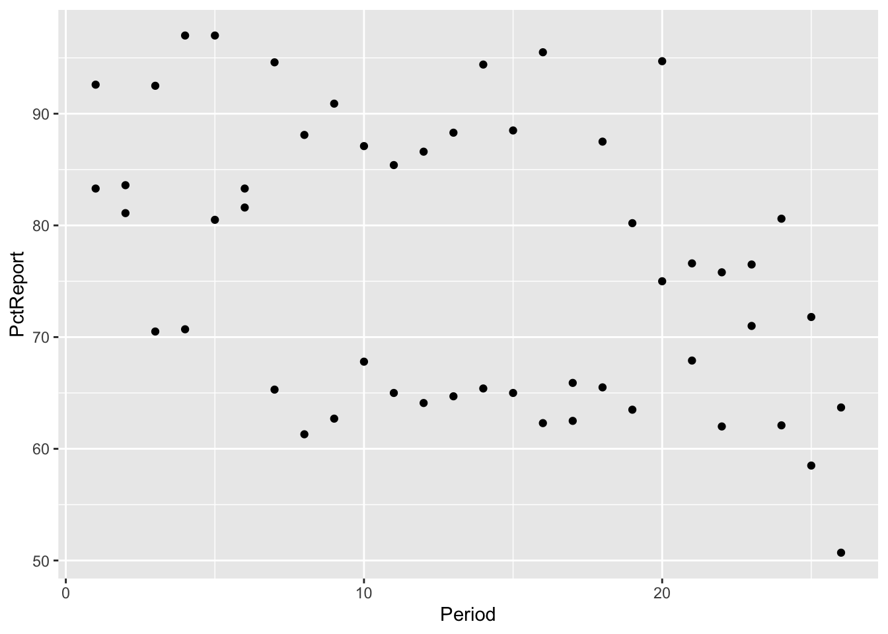
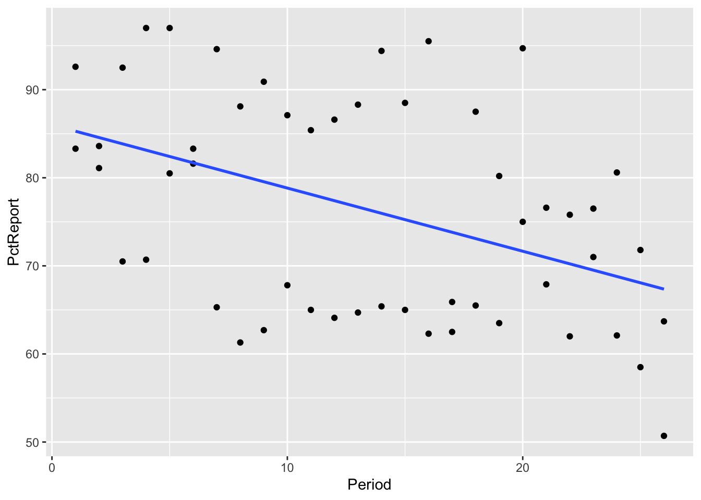
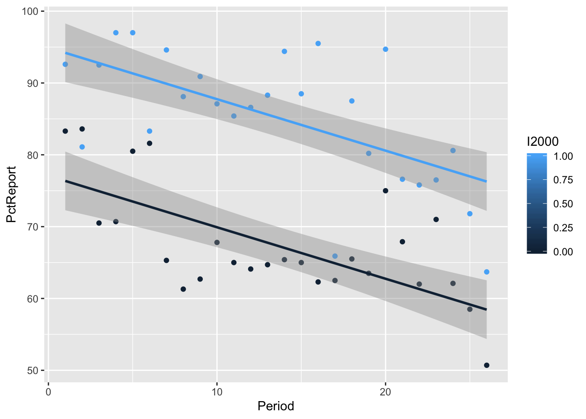
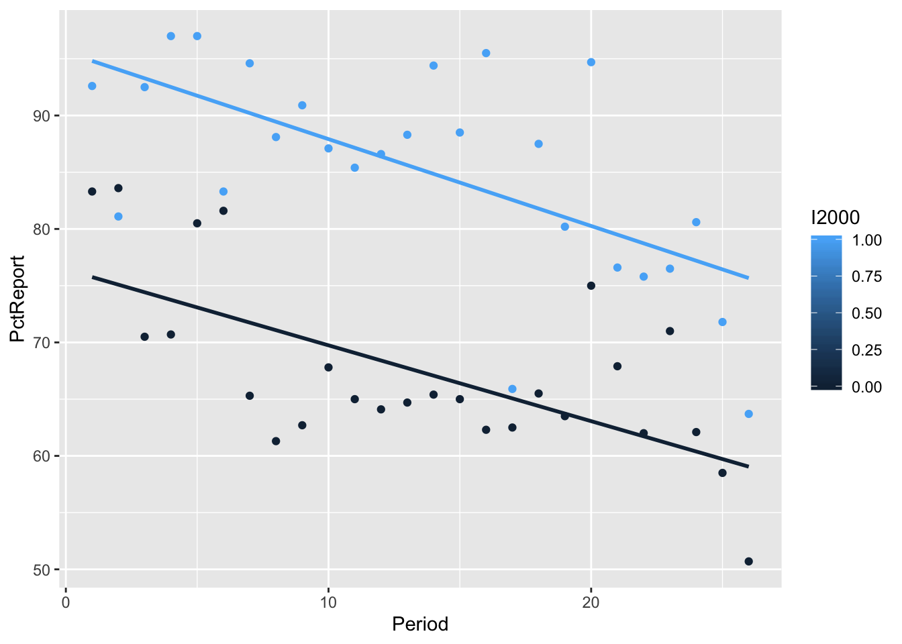

## R Markdown

This is an R Markdown document. Markdown is a simple formatting syntax for authoring HTML, PDF, and MS Word documents. For more details on using R Markdown see <http://rmarkdown.rstudio.com>.

When you click the **Knit** button a document will be generated that includes both content as well as the output of any embedded R code chunks within the document. You can embed an R code chunk like this:



## Model 1


```r
qplot(y=PctReport, x=Period, data=Jurors) + geom_smooth(method="lm", se=FALSE)
```



```r
summary(lm(PctReport~Period,data=Jurors))
```

```
## 
## Call:
## lm(formula = PctReport ~ Period, data = Jurors)
## 
## Residuals:
##      Min       1Q   Median       3Q      Max 
## -18.9639 -10.3251  -0.5314   8.3653  23.0385 
## 
## Coefficients:
##             Estimate Std. Error t value Pr(>|t|)    
## (Intercept)  85.9989     3.2156  26.744  < 2e-16 ***
## Period       -0.7169     0.2082  -3.443  0.00117 ** 
## ---
## Signif. codes:  0 '***' 0.001 '**' 0.01 '*' 0.05 '.' 0.1 ' ' 1
## 
## Residual standard error: 11.26 on 50 degrees of freedom
## Multiple R-squared:  0.1916,	Adjusted R-squared:  0.1755 
## F-statistic: 11.85 on 1 and 50 DF,  p-value: 0.001172
```


## Model 2


```r
qplot(y=PctReport, x=Period, group=I2000, color=I2000, data=Jurors) + geom_parallel_slopes()
```



```r
summary(lm(PctReport~Period+I2000,data=Jurors))
```

```
## 
## Call:
## lm(formula = PctReport ~ Period + I2000, data = Jurors)
## 
## Residuals:
##      Min       1Q   Median       3Q      Max 
## -16.8294  -3.3873  -0.8705   4.7642  14.1212 
## 
## Coefficients:
##             Estimate Std. Error t value Pr(>|t|)    
## (Intercept)  77.0816     2.1297  36.193  < 2e-16 ***
## Period       -0.7169     0.1241  -5.779 5.12e-07 ***
## I2000        17.8346     1.8608   9.585 8.08e-13 ***
## ---
## Signif. codes:  0 '***' 0.001 '**' 0.01 '*' 0.05 '.' 0.1 ' ' 1
## 
## Residual standard error: 6.709 on 49 degrees of freedom
## Multiple R-squared:  0.7188,	Adjusted R-squared:  0.7073 
## F-statistic: 62.63 on 2 and 49 DF,  p-value: 3.166e-14
```


## Model 3


```r
qplot(y=PctReport, x=Period, group=I2000, color=I2000, data=Jurors) + geom_smooth(method="lm", se=FALSE)
```



```r
summary(lm(PctReport~Period+I2000+Period*I2000,data=Jurors))
```

```
## 
## Call:
## lm(formula = PctReport ~ Period + I2000 + Period * I2000, data = Jurors)
## 
## Residuals:
##     Min      1Q  Median      3Q     Max 
## -16.659  -3.148  -1.024   4.430  14.437 
## 
## Coefficients:
##              Estimate Std. Error t value Pr(>|t|)    
## (Intercept)   76.4255     2.7331  27.963  < 2e-16 ***
## Period        -0.6683     0.1770  -3.776 0.000439 ***
## I2000         19.1468     3.8652   4.954 9.44e-06 ***
## Period:I2000  -0.0972     0.2503  -0.388 0.699473    
## ---
## Signif. codes:  0 '***' 0.001 '**' 0.01 '*' 0.05 '.' 0.1 ' ' 1
## 
## Residual standard error: 6.768 on 48 degrees of freedom
## Multiple R-squared:  0.7197,	Adjusted R-squared:  0.7022 
## F-statistic: 41.08 on 3 and 48 DF,  p-value: 2.658e-13
```
