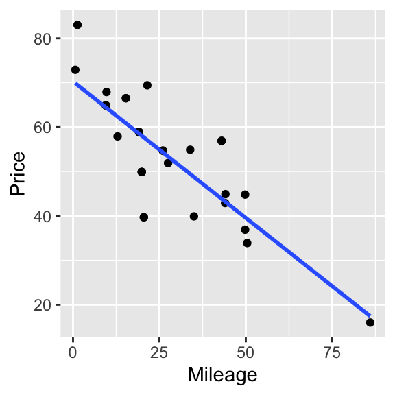
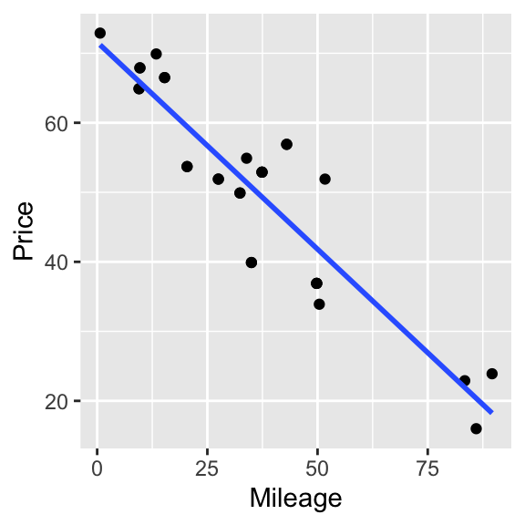
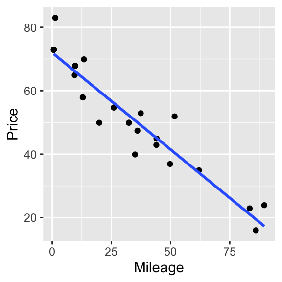
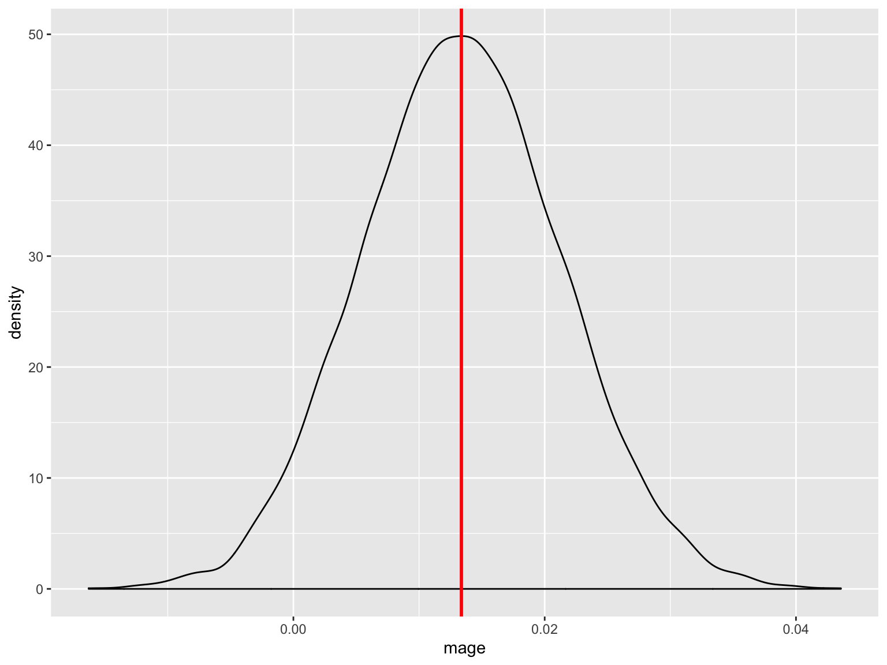
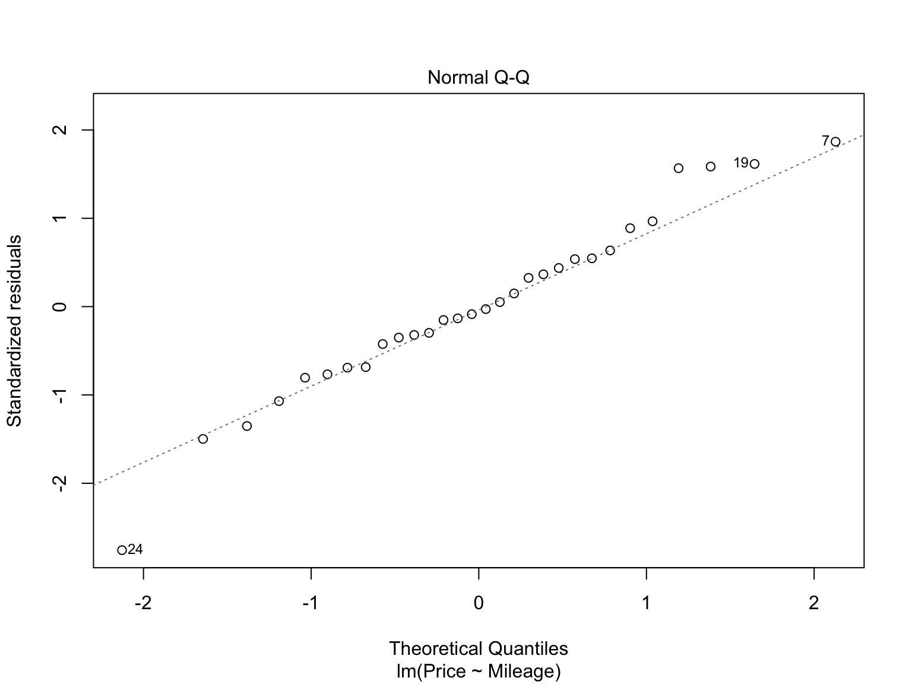

## Assumptions for Regression

Linear regression assumes:

- Linearity
- Constant Variance
- Normality of Residuals

What do you do if those assumptions aren't met?

- Transformation the X or Y variables 
- **Use a different testing approach that has fewer assumptions**

Book talks about two different approaches, each has its own specific pupose:

- Randomization test: To test the relationship between two factors (4.5)
- Bootstrap: To estimate the standard deviation/error for a statistic and/or bounds/CI around a statistic

## The Bootstrap

We are sampling *with replacement* to get a *sampling distribution*.

  - Bootstrap focuses on the sampling distribution, which means it can help calculate standard errors and 95% CIs.

The key idea of *how* to do it:

- We create new samples from the original sample by sampling with replacement
    - Since the sample is collected randomly, we can assume the population looks like many different iterations of this sample
- We calculate the desired statistic
- We repeat many times to get the bootstrap distribution
    - Then use this distribution to estimated SD/SE, etc.

The key idea of *why* we'd do it:

- We want to characterize the sampling distribution underlying a given statistic so we can calcuate CIs
- Works when the assumption of the errors being normally distributed is violated
    - Examples: slope of the regression line 

## Bootstrap Example: Porsche Data
In this example we are examining the prices of Porsches. We want to estimate the `Price` as a function of the `Mileage`. Our sample of 30 cars looks like this:


```r
require(Stat2Data)
require(mosaic)
data("PorschePrice")
qplot(y=Price, x=Mileage, data=PorschePrice)+geom_smooth(method="lm", se=FALSE)
```


## Bootstrap Sample

To create a bootstrap sample, we select rows from the data frame uniformly at random, but with replacement. Here we've created one bootstrap sample and estimated the slope of the regression line as the bootstrap statistic.


```r
qplot(y=Price, x=Mileage, data=resample(PorschePrice))+geom_smooth(method="lm", se=FALSE)
```







## Bootstrap distributions and confidence intervals

One advantage of the bootstrap is that it allows us to construct a sampling distribution for the slope coefficient that is not depedent upon the conditions for linear regression being met. 

The original confidence intervals for our SLR model depend upon the conditions (normality, etc.) being true. 

Remember the birthweight example we had for simple linear regression?


```
## 
## Call:
## lm(formula = weight ~ mage, data = data_bwt)
## 
## Residuals:
##     Min      1Q  Median      3Q     Max 
## -6.1277 -0.7120  0.1972  0.9380  4.6089 
## 
## Coefficients:
##             Estimate Std. Error t value Pr(>|t|)    
## (Intercept) 6.739962   0.212638  31.697   <2e-16 ***
## mage        0.013372   0.007675   1.742   0.0818 .  
## ---
## Signif. codes:  0 '***' 0.001 '**' 0.01 '*' 0.05 '.' 0.1 ' ' 1
## 
## Residual standard error: 1.507 on 998 degrees of freedom
## Multiple R-squared:  0.003032,	Adjusted R-squared:  0.002033 
## F-statistic: 3.035 on 1 and 998 DF,  p-value: 0.08177
```

```
##                    2.5 %     97.5 %
## (Intercept)  6.322692427 7.15723083
## mage        -0.001689331 0.02843291
```


That violates the normality assumption and thus limits our ability to use inferential statistics (t-tests, p-values, 95% CIs) -- we know that the calculated CIs and tests are wrong since the assumptions have been violated.

Now let's create a bootstrap distribution for the regression coefficients.


```r
bootstrap <- do(10000) * coef(lm(weight~mage, data=resample(data_bwt)))
p2 <- ggplot(bootstrap, aes(x=mage)) + 
  geom_density() +
  geom_vline(aes(xintercept=coef(m_mage)["mage"]),
            color="red", size=1)
p2
```



The bootstrap distribution will always be centered around the value from our real data (in this case 0.013372), but shows us some other likely values for the coefficient (essentially, sampling error). One way to quantify this variability is to create a confidence interval.


## Creating CIs 

Remember (from the reading I'm sure you all did before class!), there are three methods for constructing confidence intervals from the bootstrap. The most robust method is using quantiles of the bootstrap distribution (Method #2), but we'll talk about all three. 

### Method #1 - SD of the Bootstrap Distribution

The first method assumes that the bootstrap distribution is **normal**. 

  - Huh?? If it were normal, we would just use a normal distribution to approximate the sampling distribution. (If you're scratching your head, it's not you. Yes, this assumption is weird.)

In this case we could use the standard deviation of the bootstrap distribution to construct a confidence interval for the slope coefficient. 


```r
zs <- qnorm(0.975)
sd <- bootstrap %>% 
  summarise(sd=sd(mage))

uci<-coef(m_mage)["mage"] + (zs * sd) %>%
    rename(uci=sd)
lci<-coef(m_mage)["mage"] - (zs * sd)%>%
    rename(lci=sd)
cbind(lci,uci)
```

```
##            lci        uci
## 1 -0.002371764 0.02911535
```

### Method #2 - Quantiles from the Bootstrap Distribution

The second method does not require that the bootstrap distribution be normal.

This approach works best when the distribution is roughly symmetric. 

In this case we simply use the *percentiles of the bootstrap distribution* to build confidence intervals. **This method makes the most sense in the most cases.**


```r
qdata(~mage, p=c(0.025, 0.975), data=bootstrap)
```

```
##           quantile     p
## 2.5%  -0.002119143 0.025
## 97.5%  0.029308818 0.975
```

### Method #3 - Reverse the quantiles from the bootstrap distribution

If the bootstrap distribution is skewed, then we need to modify the second method to work in reverse. This is because our estimate may already differ from the true population parameter. 

The bootstrap distribution for the slope coefficient in this case, however, is not skewed. 


```r
qs <- qdata(~mage, p = c(0.025, 0.975), data=bootstrap)$quantile
coef(m_mage)["mage"] - (qs - coef(m_mage)["mage"])
```

```
## [1]  0.028862726 -0.002565235
```


## Porsche Price Example


```
## 
## Call:
## lm(formula = Price ~ Mileage, data = PorschePrice)
## 
## Residuals:
##      Min       1Q   Median       3Q      Max 
## -19.3077  -4.0470  -0.3945   3.8374  12.6758 
## 
## Coefficients:
##             Estimate Std. Error t value Pr(>|t|)    
## (Intercept) 71.09045    2.36986    30.0  < 2e-16 ***
## Mileage     -0.58940    0.05665   -10.4 3.98e-11 ***
## ---
## Signif. codes:  0 '***' 0.001 '**' 0.01 '*' 0.05 '.' 0.1 ' ' 1
## 
## Residual standard error: 7.17 on 28 degrees of freedom
## Multiple R-squared:  0.7945,	Adjusted R-squared:  0.7872 
## F-statistic: 108.3 on 1 and 28 DF,  p-value: 3.982e-11
```

```
##                  2.5 %     97.5 %
## (Intercept) 66.2360186 75.9448869
## Mileage     -0.7054401 -0.4733618
```




```r
zs <- qnorm(c(0.025, 0.975))
coef(fm)["Mileage"] + zs * sd(~Mileage, data=bootstrap_Porsche)
```

```
## [1] -0.6896867 -0.4891152
```


```r
qdata(~Mileage, p=c(0.025, 0.975), data=bootstrap_Porsche)
```

```
##         quantile     p
## 2.5%  -0.6870217 0.025
## 97.5% -0.4858929 0.975
```


```r
qs <- qdata(~Mileage, p = c(0.025, 0.975), data=bootstrap_Porsche)$quantile
coef(fm)["Mileage"] - (qs - coef(fm)["Mileage"])
```

```
## [1] -0.4917802 -0.6929090
```
