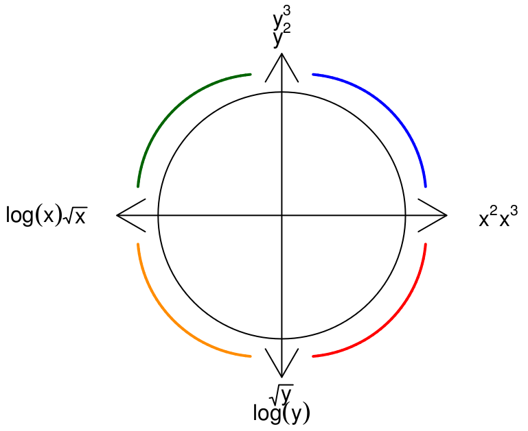

```{r setup, include=FALSE}
knitr::opts_chunk$set(echo = TRUE)
```


```{r}
library(tidyverse)
StateSAT82<-read.csv(url("https://sds291.netlify.com/15/StateSAT82.csv"))
StateSAT82 <- StateSAT82 %>%
	mutate(Takers_Sq=Takers^2,
	       Takers_log=log(Takers))
qplot(x=Takers, y=SAT, data=StateSAT82)
```

Based on Tukey's Bulge, it would be reasonable to think that the best transformation of these data would be to take the log of x (Takers).



The example that we included used $x^2$ instead. Why?

Let's fit the two different models to see.

# $X^2$
```{r}
quadmod <- lm(SAT~Takers+Takers_Sq, data=StateSAT82)
summary(quadmod)

qplot(x=Takers, y=SAT, data=StateSAT82) + 
  stat_smooth(method = "lm", formula=y ~ x + I(x^2), se=FALSE)
```

The $R^2$ here is 0.82, and the shape of this line seems to fit the data fairly well, especially at the highest percentage taking counties.

#log(Takers)
```{r}
logmod <- lm(SAT~Takers+Takers_log, data=StateSAT82)
summary(logmod)

qplot(x=Takers, y=SAT, data=StateSAT82) + 
  stat_smooth(method = "lm", formula=y ~ x + log(x), se=FALSE)
```

The $R^2$ here is 0.80, which is slightly less of a good fit (but still an *extremely* high $R^2$). The log transformation curves the shape of the regression line early, and the shape of this line fits the data a little less well at the the highest percentage taking counties (40+).
