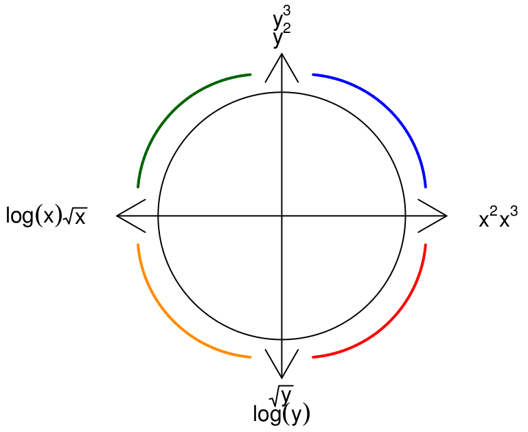

```{r include=FALSE}
# Some customization.  Do not alter unless you're very sure you know what you are doing).

# knitr settings to control how R chunks work and how the pdf is compiled when knit.
library(knitr)
require(knitr)
opts_chunk$set(
  tidy=TRUE,                     # display code as typed
  size="small",                   # slightly smaller font for code
  tidy.opts=list(width.cutoff=80), # wrap text and long comments
  fig.width=5, fig.height=3           #figure size
)
#Requiring Stat2Data package for the data
require(Stat2Data)
require(mosaic)
```

When regression assumptions aren't met, especially for non-linearity, you can often transform or make changes to your data to address these issues.

# Does the number of hospitals reflect the number of available doctors?

```{r echo=FALSE, error=FALSE, message=FALSE, warning=FALSE}
library(Stat2Data)
library(tidyverse)
data(MetroHealth83)
```

## Choose
```{r}
qplot(y=NumMDs, x=NumHospitals, data=MetroHealth83)
```

Model we choose to fit:

## Fit

```{r}
m2<-lm(NumMDs~NumHospitals, data=MetroHealth83)
summary(m2)

qplot(y=NumMDs, x=NumHospitals, data=MetroHealth83) + geom_smooth(method="lm", se=FALSE)
```

Interpretation of findings:

## Assess
```{r}
plot(m2, which=1)
```

```{r}
qplot(x=residuals(m2), data=m2)
```

```{r}
qqnorm(residuals(m2))
qqline(residuals(m2))
```


## Choose (Again)

From Tukey's Ladder, we can know that a relationship with this kind of shape might be addressed by going "down" in Y, either a square root of Y or a log of Y.



In this case, we'll use the square root.

```{r}
MetroHealth83 = MetroHealth83 %>%
  mutate(sqrtMDs = sqrt(NumMDs))
#MetroHealth83$sqrtMDs<-sqrtMDs(NumMDs)
qplot(y=sqrtMDs, x=NumHospitals, data=MetroHealth83)
```

What Model are we choosing? <!---$$\sqrt{Y} = \beta_0 + \beta_1 \cdot NumHospitals + \epsilon $$--->

##Fit (Again)
```{r}
m3<-lm(sqrtMDs~NumHospitals, data=MetroHealth83)
summary(m3)

qplot(y=sqrtMDs, x=NumHospitals, data=MetroHealth83) + geom_smooth(method="lm", se=FALSE)
```

Interpretation of findings:

## Assess (Again)
```{r}
plot(m3, which=1)
```

```{r}
qplot(x=residuals(m3))
```

```{r}
qqnorm(residuals(m3))
qqline(residuals(m3))
```

## Use (Again)

What if we predict for a city like Louisville that has 18 hospitals how many doctors there would be. Be sure you have the units right!

```{r, message=FALSE, warning=FALSE, error=FALSE}
#This is a part of the mosaic package that makes prediction somewhat easier
library(mosaicCore)
predictedMDs<-makeFun(m3)
predictedMDs(NumHospitals=18)
predictedMDs(NumHospitals=18)^2
```

## Extra practice

Remember that Tukey's Ladder suggests something with a given shape could be addressed by either changes to Y (those suggested to the right of the red curved line in Tukey's bulge graphic), X (those suggested at the top of the red curved line), or both.

Practice transforming X instead (use code from the SAT example on the slides to help). Do you get the same sort of answer or as good of a fitting model?

# Capacitor voltage

A [capacitor](https://en.wikipedia.org/wiki/Capacitor) was chard with a 9-volt battery and then a voltmeter recorded the coltage as the capacitor was discharged. Measurements were taken every 0.02 secton. The data are in the dataset `Volts`

```{r}
data("Volts")
qplot(y=Voltage, x=Time, data=Volts)
```

```{r}
m_volts_linear<-lm(Voltage~Time, data=Volts)
summary(m_volts_linear)
qplot(y=Voltage, x=Time, data=Volts) + geom_smooth(method = "lm", se=FALSE)
plot(m_volts_linear, which=1)
```
We can see this linear model is not a good fit for these data -- even though there is a small p-value and a big $R^2$, etc.!

We could interpret this model as saying every 1 second after being charged, the capacitor's voltage decreases by -7.5549 volts.

This looks so clearly non-linear. Specifically, this pattern looks like the downward curved shape from Tukey's Ladder, such that we could also transform `Y` with a square root or a log.


In this case, let's use a log. 

```{r}
Volts <- Volts %>%
  mutate(ln_Voltage = log(Voltage))

m_volts_logged<-lm(ln_Voltage~Time, data=Volts)
summary(m_volts_logged)
qplot(y=ln_Voltage, x=Time, data=Volts) + geom_smooth(method = "lm", se=FALSE)
plot(m_volts_logged, which=1)
```

Here, we see an *extremely* strong relationship between Time and the log of Voltage.  We could interpret this model as saying every 1 seconds after being charged, the capacitor's voltage decreases by -2.05 logged volts.  You can see this visually - when seconds is 0 is the intercept (2.18) and the slope in seconds has gone down by 2.06 log(Volts) after 1 second.

Let's predict what our model would have suggested for how many volts the capacitor would have had a 0.5 seconds:

```{r, message=FALSE, warning=FALSE, error=FALSE}
#This is a part of the mosaic package that makes prediction somewhat easier
library(mosaicCore)
predictedVolts<-makeFun(m_volts_logged)
#Volts are still on the log scale
predictedVolts(Time=0.5)
#Exponentiate to take the predicted value back to the original Volts scale
exp(predictedVolts(Time=0.5))
```

The code above, from the `mosaic` package makes a prediction function (`makeFun()`) that we're calling `predictedVolts` based on our regression model for a given value of the X variable.  

The first value is given in the log(Volts) unit - our model would have predicted that the capacitor would have had 1.16 log(Volts) at 0.5 seconds. If you look at the graph with Volts on the log scale above, that looks about right.

But we want *actual* volts. So we can exponentiate that predicted value (hence the `exp()` around the prediction function) and get the actual units (Volts), depicted in the first set of graphs. Thus, we see that our model - estimated on the log(Volts) scale - would have predicted the capacitor to have had 3.19 Volts at 0.5 seconds.  If you look back to the graph on the original scale, that corresponds closely with the actual value at 0.5 seconds (and should, since this model estimated the relationship so closely).

For comparison, let's see what the linear model would have predicted: 

```{r}
predictedVolts_linear<-makeFun(m_volts_linear)

predictedVolts_linear(Time=0.5)
```

And the linear model *did* overestimate this relationship, for this part of the model - it was trying to fit something linear to a curved relationship, so it was overestimating the middle times and underestimating the first and last times.

This suggests the log-transformed model is doing a much better job at fitting the relationship between time and voltage.