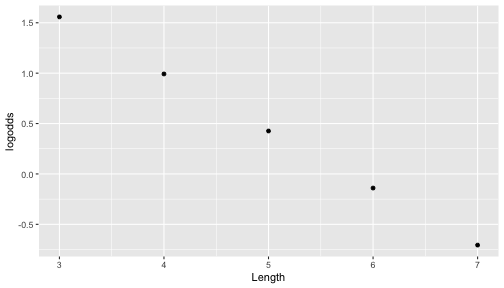
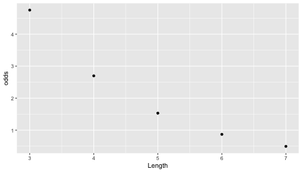
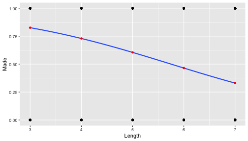

---

## Outline for the Week

.pull-left[
### Today

- How to Choose a Logistic Regression Model

- How to define, calculate, and interpret Odds Ratios

]

.pull-right[
### Thursday

- What are the assumptions for logistic regression and how do we evaluate whether they're met?

- How do we conduct formal inference to our population of interest with a logistic model?

]

---
## Quantitative vs. Binary Response Variables

#### Often, we want to model a **response** variable that is **binary**, meaning that it can take on only two possible outcomes. 

#### These outcomes could be labeled "Yes" or "No", or "True" of "False", but for all intents and purposes, they can be coded as either 0 or 1. 

#### We have seen these types of variables before (as indicator variables), but we always used them as **explanatory** variables. 

#### Creating a model for such a variable as the response requires a more sophisticated technique than ordinary least squares regression. It requires the use of a **logistic** model.


---

## Quick Aside: Other kinds of logistic models

There are forms of logistic regression for:

- Binary (logistic - what we're doing in this class)
  - Alive : 0 = Dead, 1 = Alive
  
- Ordinal (ordered logistic regression)
  - Self Rated Health : 0=Excellent, 1=Very Good, 2=Good, 3=Fair, 4=Poor

- Nominal (multinomial logistic regression)
  - Political Party: 0=Democrat, 1=Green Party, 2=Independent, 3=Republican, 4=Reform Party

---

## Example: Binary Response, Quantitative Explanatory Variable

.pull-left[
Let's stay with the mini-golf example from last week: the putt either made it or it missed from a number of feet away from the hole.

Our goal is to determine the association between `Length` (in feet) and likelihood of making the put (`Made`= 0 (missed) or 1 (made)); we're using data called `Putts1` from the book's data package.
]

.pull-right[


]


---
# Jitter is your friend

.pull-left[
.tiny[

```r
regular_plot<-qplot(x=Length,y=Made,data=Putts1)

regular_plot
```

<!-- -->
]

]
.pull-left[
.tiny[

```r
jitter_plot <- qplot(x=Length,y=Made,data=Putts1) +
  geom_jitter(height = 0.05)
jitter_plot
```

<!-- -->
]
]

---

## Basic Prediction

.pull-left[
.medium[


```r
Putts1 <- Putts1 %>%
  mutate(avg_Made = mean(Made))

Putts1 %>%
  select(avg_Made) %>% 
  slice(1) %>%
  head 
```

```
##    avg_Made
## 1 0.5758092
```
]

What does this number mean?

]
 
.pull-right[
.tiny[

```r
jitter_plot + 
  geom_hline(aes(yintercept = avg_Made),Putts1,color='coral', size=2)
```

<!-- -->
]
What would we predict for a 3 foot putt? A 7 foot putt? Does this make sense?
]

---
# Could we use a linear model?

In linear regression, the model predicts the mean of the response $Y$ (or $\bar{y}$) at each level of the explaatory variable(s).

What's the "mean" of a 0/1 indicator variable?

$\bar{y} =\frac{\sum{y_i}}{n} = \frac{\text{# of 1's}} {\text{# of trials}} = \text{Proportion of success}$

So with a linear model for these data, essentially we are modeling $\pi$ (the response variable) like this
$$
  \pi = \beta_0 + \beta_1 Length
$$

[Note: Economists use this approach not infrequently and call it the "linear probability model", one of the different options for working with a "binary dependent variable"]

---
# Fitted linear model


```r
Putts_linear <- lm(Made ~ Length , data=Putts1)
summary(Putts_linear)
```

```
## 
## Call:
## lm(formula = Made ~ Length, data = Putts1)
## 
## Residuals:
##     Min      1Q  Median      3Q     Max 
## -0.8440 -0.4650  0.1560  0.4087  0.6613 
## 
## Coefficients:
##             Estimate Std. Error t value Pr(>|t|)    
## (Intercept)  1.22295    0.07155  17.091   <2e-16 ***
## Length      -0.12633    0.01346  -9.383   <2e-16 ***
## ---
## Signif. codes:  0 '***' 0.001 '**' 0.01 '*' 0.05 '.' 0.1 ' ' 1
## 
## Residual standard error: 0.4616 on 585 degrees of freedom
## Multiple R-squared:  0.1308,	Adjusted R-squared:  0.1293 
## F-statistic: 88.04 on 1 and 585 DF,  p-value: < 2.2e-16
```

- Interpret the coefficients of this model.
- Predict the probability of making a putt for 1,3,7, and 10 feet away.

??? 

When you are *in* the hole (Length=0), you would have a 122% probability of making a putt. For every additional foot away you are from the hole, probability of making the putt goes down by 12.6 percentage points.

From this model, a:
- 1 foot putt would have a 109.6% probability of making it (`1.22295 +(-0.12633*1)`).
- 3 foot putt would have a 84% probability of making it (`1.22295 +(-0.12633*3)`). 
- 7 foot putt would have a 34% probability of making it (`1.22295 +(-0.12633*7)`).
- 10 foot putt would have a -4% probability of making it (`1.22295 +(-0.12633*10)`).

---
# Seeing the Linear Model visually

.pull-left[
### Basic Probability
<!-- -->

]

.pull-right[
### Linear Model 
<!-- -->

]

---
# Summary Thus Far

## Basic Probability

- Every putt has the same probability no matter how far away
- Doesn't seem to fit the visual depiction of a negative relationship

## Linear Model

- Use probability / proportion as the response, fit a linear model of length as explanatory
- Models the negative relationship  (i.e., *does* fit the visual depiction)
- But makes impossible predictions (probabilities <0 or >1)

### So, we do not think that a linear model with probability as the response variable is the way to go. 

---
class: inverse, middle, center
### We saw that a linear model of probabilities may not make sense. 

### What if we used different units and/or transformed the dependent variable? 

## Would that make for a better fitting model?

---
class: inverse, middle, center

#### We had previously worked with log transformations. 

#### And with odds, and saw their relationship to probabilities.

## The Logistic Transformation combines both ideas: it uses the (natural) log of the odds. 

#### *Goal of logistic regression:* Predict the _true proportion of success_, $\pi$, at any value of the explanatory/predictor variable.

---
Our previous linear model:
$$
  \pi = \beta_0 + \beta_1 X
$$

Where:

- Y = Binary Response Variable (Made the Putt)
- X = Quantitative Explanatory Variable (Length)
- $\pi$ = Proportion of 1's (yes, successes; here, *making the putt*) at any X (length)

Instead, suppose we modeled it like this
$$
  \log \left( \frac{\pi}{1-\pi} \right) = logit(\pi) = \beta_0 + \beta_1 X
$$

This transformation is called the **logit** function, or what the book calls the "Logit form". 

Remember that you can go estimate the probability from the odds ( $\pi = \frac{odds}{1+odds}$ ) and exponentiate to anti-log. So you could also express this regression model as:

$$
  \pi = \frac{e^{\beta_0 + \beta_1 X}}{1 + e^{\beta_0 + \beta_1 X}} \in (0,1)
$$
 
which the book calls, the "Probability form" of the model.

---
### Why use this approach?
- The logit function _constrains the fitted values to lie within $(0,1)$_, which helps to give a natural interpretation as the probability of the response actually being 1.
  - This avoids the estimated probabilities <0 and >1 that we got from the linear regression model above

### What's happening in this model? How is it getting fitted?
- No more squares and residuals - or OLS as the method for fitting
- No more $R^2$ or other tests / estimates that use the sum of squares (there are approximations, though...)
- Instead, *maximum likelihood estimation* which we'll talk about more in the next class.

### How do I do this in `R`?
- Glad you asked...

---
## Fitting a Logistic Model in `R`


```r
Putts_logistic <- glm(Made ~ Length, data=Putts1, family=binomial)
```

### What's different about this code from what we have used?

---
### GLM does the same thing as LM if you ask...

.pull-left[
.tiny[

```r
m0_lm <- lm(Made ~ Length, data=Putts1)
summary(m0_lm)
```

```
## 
## Call:
## lm(formula = Made ~ Length, data = Putts1)
## 
## Residuals:
##     Min      1Q  Median      3Q     Max 
## -0.8440 -0.4650  0.1560  0.4087  0.6613 
## 
## Coefficients:
##             Estimate Std. Error t value Pr(>|t|)    
## (Intercept)  1.22295    0.07155  17.091   <2e-16 ***
## Length      -0.12633    0.01346  -9.383   <2e-16 ***
## ---
## Signif. codes:  0 '***' 0.001 '**' 0.01 '*' 0.05 '.' 0.1 ' ' 1
## 
## Residual standard error: 0.4616 on 585 degrees of freedom
## Multiple R-squared:  0.1308,	Adjusted R-squared:  0.1293 
## F-statistic: 88.04 on 1 and 585 DF,  p-value: < 2.2e-16
```
]
]/

.pull-right[
.tiny[

```r
m0_glm <- glm(Made ~ Length, data=Putts1, family=gaussian)
summary(m0_glm)
```

```
## 
## Call:
## glm(formula = Made ~ Length, family = gaussian, data = Putts1)
## 
## Deviance Residuals: 
##     Min       1Q   Median       3Q      Max  
## -0.8440  -0.4650   0.1560   0.4087   0.6613  
## 
## Coefficients:
##             Estimate Std. Error t value Pr(>|t|)    
## (Intercept)  1.22295    0.07155  17.091   <2e-16 ***
## Length      -0.12633    0.01346  -9.383   <2e-16 ***
## ---
## Signif. codes:  0 '***' 0.001 '**' 0.01 '*' 0.05 '.' 0.1 ' ' 1
## 
## (Dispersion parameter for gaussian family taken to be 0.2130288)
## 
##     Null deviance: 143.38  on 586  degrees of freedom
## Residual deviance: 124.62  on 585  degrees of freedom
## AIC: 762.14
## 
## Number of Fisher Scoring iterations: 2
```
]
]

---
## Visualizing the Logistic Regression Model

.pull-left[
# Extended Version

<!-- -->

]

.pull-right[
# Zoomed / Focused Version
<!-- -->

]

---
## Plotting the model in space: 3 ways

We can think of visualizing logistic regression models with one of three forms of the outcome:

- log-odds
- odds
- probability

Each depiction is illustrating the _same_ model.

The differences are just to illustrate how the same model operates with the different forms of outcomes.


---
# Log-Odds

The first is the linear model, where we are considering log-odds. This is the actual model we're fitting -- a linear model on the log scale.


```r
qplot(x=Length, y=logodds, data=logit_data)
```

<!-- -->

---
# Odds

The second is the odds, which are a more understandable set of units than the log(odds). 

```r
qplot(x=Length, y=odds, data=logit_data)
```

<!-- -->

---
# Probability

The third is the probability, which is an alternative set of units to the odds.

We have already seen this version before, now with the specific probabilities for each length plotted in red.


```r
regular_plot + 
  geom_smooth(method="glm",method.args=list(family="binomial"), se=FALSE,fullrange=TRUE) +
  geom_point(x=Length, y=prob, data=logit_data, color="red")
```

<!-- -->


--- 

## Interpretation of Coefficients

The interpretation of the coefficients in a linear regression model are clear based on an understanding of the geometry of the regression model.

- We use the terms *intercept* and *slope* because a simple linear regression model is a line. 

In a simple logistic model, the line is transformed by the logit function. **How do the coefficients affect the shape of the curve in a logistic model?**

---

## How do changes in the intercept term affect the shape of the logistic curve?

The intercept changing is making the curve appear as though it's moving left (goes below 7 from the fitted model) and right (goes above 7 from the fitted model). In fact, it's elongating the shape of the curve either in values of the response variable where they = 1 or 0 (here, alive and dead).

---
## How do changes in the slope term affect the shape of the logistic curve?

Higher slope terms tend to flatten out the line in the top of the curve (where the response=1, or Alive), and smaller values make the curve look more like the odds function, where it curves down and mostly goes through the values of the response = 0 (or dead).

[Note that these explanations are not always true - the shape will depend on both the intercept, the slope, and the direction of the magnitude].

---
# Math behind the OR as a measure of the slope

We can interpret $\hat{\beta_1}$ as the typical change in $\log{(odds)}$ for each one unit increase in the explanatory variable. 

More naturally, the odds of success are multiplied by $e^{\hat{\beta_1}}$ for each one unit increase in the explanatory variable, since this is the **odds ratio**.

$$
  \begin{aligned}
      odds_X &= \frac{\hat{\pi}_X}{1 - \hat{\pi}_X} = e^{\hat{\beta}_0 + \hat{\beta}_1 X} \\
			odds_{X+1} &= \frac{\hat{\pi}_{X+1}}{1 - \hat{\pi}_{X+1}} = e^{\hat{\beta}_0 + \hat{\beta}_1 (X + 1)} \\
			\frac{odds_{X+1}}{odds_X} &= \frac{e^{\hat{\beta}_0 + \hat{\beta}_1 (X + 1)}}{e^{\hat{\beta}_0 + \hat{\beta}_1 X}} = e^{\hat{\beta}_1}
  \end{aligned}
$$
Furthermore, since the *logits* are linear with respect to the explanatory variable, these changes are constant. 

---
## Calculating Odds Ratios and 95% CIs
Finding confidence intervals for the odds ratio is easy. We could look at the point estimate and standard error from the `summary()` and use the `qnorm()` function to find a critical z value, or we could just use the convenience function `confint()`. 

```r
#Odds Ratio
exp(coef(Putts_logistic))
```

```
## (Intercept)      Length 
##  25.9673093   0.5677116
```

```r
#95% Confidence Interval
exp(confint(Putts_logistic))
```

```
##                  2.5 %     97.5 %
## (Intercept) 12.7974573 54.4505172
## Length       0.4960611  0.6464444
```


```r
#to get the OR and 95% CI side by side
exp(cbind(OR = coef(Putts_logistic), confint(Putts_logistic)))
```

```
## Waiting for profiling to be done...
```

```
##                     OR      2.5 %     97.5 %
## (Intercept) 25.9673093 12.7974573 54.4505172
## Length       0.5677116  0.4960611  0.6464444
```

<!-- **OR Interpretation**: For every additional year of age, the odds of 20-year survival are 0.88 times those of someone one year younger. In other words, someone one year older has a 12% lower odds of surviving 20 years than someone a year younger (23 year old vs. a 22 year old). This makes sense - older age is associated with higher odds of mortality and, conversely, lower odds of survival. We are 95% confident that the true odds ratio for a one-year difference in age on 20-year survival is between 0.87 and 0.89 on average in the population. -->

<!-- Indeed, if we did change the outcome to estimate whether someone died in the 20 year follow-up (the inverse of what we're estimating with `isAlive`): -->
<!-- ```{r} -->
<!-- logit_dead <- glm(outcome ~ age , data=Whickham, family=binomial) -->
<!-- exp(cbind(OR = coef(logit_dead), confint(logit_dead))) -->
<!-- ``` -->

<!-- we see that for each additional year of age, the odds of 20-year mortality is 1.129 times higher than for someone a year younger. In other words, every year of age is associated with a 13% _higher_ odds of death within 20 years, on average, in the population. -->

## Odds Ratios: 2x2 tables

We have seen - and calculated! - the odds ratio from 2-by-2 tables for this example. Let's confirm that we can re-create those results with a regression model -- thereby illustrating that $e^{\hat\beta_1}$ is the odds ratio.


```r
Putts1_6_7 <- Putts1 %>%
  filter(Length %in% c(6,7)) 

Putts1_6_7%>%
  group_by(Length) %>%
  count(Made)
```

```
## # A tibble: 4 x 3
## # Groups:   Length [2]
##   Length  Made     n
##    <int> <int> <int>
## 1      6     0    64
## 2      6     1    61
## 3      7     0    90
## 4      7     1    44
```

These are the same numbers we saw before. 

$$ OR = \frac{44/90}{61/64} = 0.512 $$
$$ log(OR) = -0.667 $$
$$ SE(OR) = \sqrt{\frac{1}{\text{a}} +\frac{1}{\text{b}}+\frac{1}{\text{c}}+\frac{1}{\text{d}}} = \sqrt{\frac{1}{\text{44}} +\frac{1}{\text{90}}+\frac{1}{\text{61}}+\frac{1}{\text{64}}} = 0.25 $$
$$ 95\% CI = e^{ln(OR) \pm z* SE(OR)} = e^{-0.667 \pm 1.96*0.25} = e^{( -1.17, -0.16)} = 0.31, 0.85 $$

See last completed slide from previous class.


```r
Putts_logistic_6_7 <- glm(Made ~ Length, data=Putts1_6_7, family=binomial)
summary(Putts_logistic_6_7)
```

```
## 
## Call:
## glm(formula = Made ~ Length, family = binomial, data = Putts1_6_7)
## 
## Deviance Residuals: 
##     Min       1Q   Median       3Q      Max  
## -1.1571  -0.8922  -0.8922   1.1979   1.4924  
## 
## Coefficients:
##             Estimate Std. Error z value Pr(>|z|)   
## (Intercept)   3.9577     1.6695   2.371  0.01776 * 
## Length       -0.6676     0.2566  -2.601  0.00928 **
## ---
## Signif. codes:  0 '***' 0.001 '**' 0.01 '*' 0.05 '.' 0.1 ' ' 1
## 
## (Dispersion parameter for binomial family taken to be 1)
## 
##     Null deviance: 349.72  on 258  degrees of freedom
## Residual deviance: 342.86  on 257  degrees of freedom
## AIC: 346.86
## 
## Number of Fisher Scoring iterations: 4
```

```r
exp(cbind(OR = coef(Putts_logistic_6_7), confint(Putts_logistic_6_7)))
```

```
##                     OR     2.5 %       97.5 %
## (Intercept) 52.3344934 2.0105175 1411.1001622
## Length       0.5129326 0.3088407    0.8457899
```
