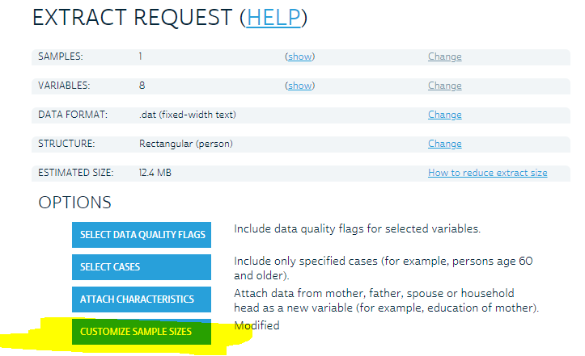
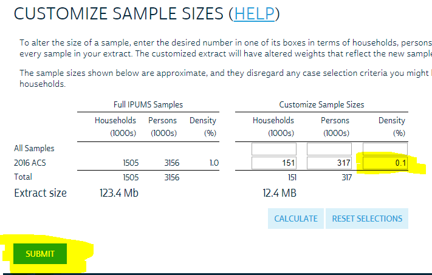
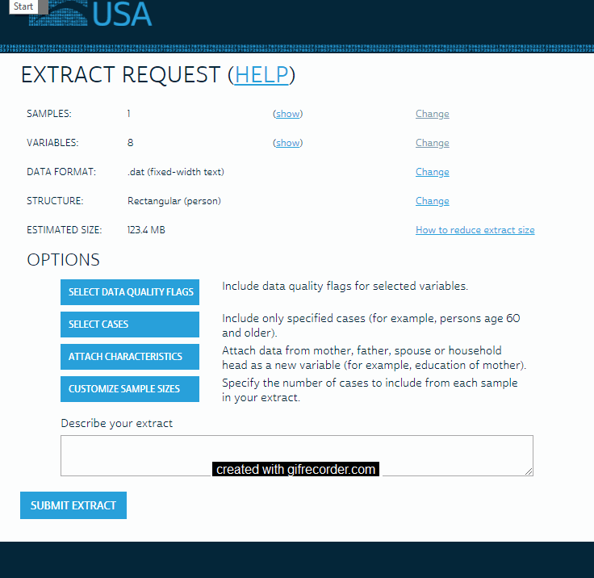

```{r setup, include=FALSE}
knitr::opts_chunk$set(echo = TRUE)
library(ipumsr)
library(tidyverse, warn.conflicts = FALSE)
```

One feature of the IPUMS-USA (AKA the American Community Survey) that gets a lot of press is the information on travel time to work. Participants self-report how long their typical commute is in minutes.  This activity will focus on two components useful for the group project and building on skills from the semester thus far. First, you will be working with the IPUMS interface to select your data, the `ipumsr` package for reading in the data, and then wrangling the data as needed. Second, you will need to build a number of multiple linear regression models and presenting the results of these models in tables and figures.

You will be building a model to estimate three models:

- the association between age and travel time, adjusted for potential confounders of your choice.
- whether the association between age and travel time varies by race (adjusted for the same potential confounders).
- a model of your choice that best predicts travel time.

# Get the data

## Group Member 1 
One person in your group should go to IPUMS and get build an extract of the following person-level variables from the **2016** sample of IPUMS USA:

Section | Variable Name | Variable label
--- | --- | ---
Demographic | SEX | Sex
Demographic | AGE | Age
Demographic | MARST | Respondent Marital Status
Demographic | FERTYR | 	Children born within the last year
Race, Ethnicity, and Nativity | RACE | Race
Race, Ethnicity, and Nativity | HISPAN | Hispanic Origin
Health Insurance | HCOVANY | Any health insurance coverage
Education | EDUC | Educational attainment
Education | DEGFIELD | Field of degree
Work | EMPSTAT | Employment Status
Work | OCC | Occupation
Work | IND | Industry
Work | UHRSWORK | Usual hours worked per week
Income | INCTOT | Total personal Income
Income | FTOTINC | Total family Income
Disability | DIFFMOB | Independent living difficulty
Disability | DIFFCARE | Self-care difficulty
Veterans Status | VETSTAT | Veteran status
Place of work and Travel | PWSTATE2 | Place of work: state
Place of work and Travel | TRANWORK | Means of transportation to work
Place of work and Travel | TRANTIME | Travel time to work

Leave in the other pre-selected variables.

Before submitting your extract, customize the sample size and select 0.10 (10%) of the full sample, to keep the file size low and the processessing speed on your computer/the server higher. (Note: for your projects, you should use all of the data -- this smaller subsample is just so we don't crash the server).







### Once your extract is ready

Save *__both__* DDI Codebook (usa_00001.xml) - right click or use option-click and save each file to your desktop - and click on the download .dat button to get the data file (usa_00001.dat.gz). Do not rename the file; do not unzip it either; make sure the file extensions are correct (see note below re browsers). Upload them to your group's google drive from your computer. 

Use the code below and refer to the help file / vignette [here.](https://cran.r-project.org/web/packages/ipumsr/vignettes/ipums.html)

If you're using a Mac, **don't use Safari** -- the files won't save correctly.  Choose another browser (Firefox or Chrome should work fine).

Also see a video of instructions on how to do that [here.](https://sds291.netlify.com/group/04-group-ipums-gettingdata/) when you have more time.

## Person 2 

Open a Shared Google Drive and add your group mates.  This should be where you save the data and all of your code files. (If you want to use git and everyone has experience doing so, you may. Otherwise, put it on Google Drive.)

# Bringing in data with `ipumsr` package

Use the `ipumsr` package to bring in the data.  

Use the code below and refer to the help file / vignette [here.](https://cran.r-project.org/web/packages/ipumsr/vignettes/ipums.html)  

```{r, eval=FALSE}
# Note that you can pass in the loaded DDI into the `read_ipums_micro()`
usa_ddi <- read_ipums_ddi("usa_00001.xml")
usa_data <- read_ipums_micro(usa_ddi, verbose = FALSE)

#Finding the variables that have a label
usa_data %>%
  select_if(is.labelled)

# Convert the labels to factors (and drop the unused levels)
usa_data2 <- usa_data %>%
  mutate(sex_factor = droplevels(as_factor(SEX)),
         marital_factor=droplevels(as_factor(MARST)),
         newchild_factor=droplevels(as_factor(FERTYR)),
         race_factor= droplevels(as_factor(RACE)),
         hispan_factor= droplevels(as_factor(HISPAN)),
         educ_factor= droplevels(as_factor(EDUC)),
         hinsur_factor= droplevels(as_factor(HCOVANY)),
         degfield_factor= droplevels(as_factor(DEGFIELD)),
         empstat_factor= droplevels(as_factor(EMPSTAT)),
         occ_factor= droplevels(as_factor(OCC)),
         ind_factor= droplevels(as_factor(IND)),
         diffmob_factor=droplevels(as_factor(DIFFMOB)),
         diffcare_factor=droplevels(as_factor(DIFFCARE)),
         vetstat_factor=droplevels(as_factor(VETSTAT)),
         pwstate_factor=droplevels(as_factor(PWSTATE2)),
         tranwork_factor=droplevels(as_factor(TRANWORK))
  )
```

# Step 2: Cleaning up the data and Do Exploratory Data Analysis

## Person 1 and 2: Working with variables
1. Make an indicator variable of whether someone is employed or not from `empstat_factor`. A reminder of the code from where you've done this before:

```{r, eval=FALSE}
#This code would create a variable called `smoke_nev` that had the values of 1 when smoke==0 and 0 otherwise.
Gestation<-Gestation %>%
  mutate(smoke_nev=if_else(smoke==0,1,0))

#Instead of 1 / 0, you could also make the variable as a factor with more meaningful labels.
Gestation<-Gestation %>%
  mutate(smoke_nev=as.factor(if_else(smoke==0,"Never Smoker","Ever Smoker")))

#If smoke had been a factor variable rather than numeric, it would have looked more like this:
Gestation<-Gestation %>%
  mutate(smoke_nev=as.factor(if_else(smoke=="never","Never Smoker","Ever Smoker")))
```

1. Recode `newchild_factor` so that it is a binary variable: yes vs. no.

1. Create a binary variable of whether someone was in a STEM field or not from `degfield_factor`. 

You need to decide which of the codes you think are STEM. see the codebook - or back at [IPUMS USA](https://usa.ipums.org/usa-action/variables/DEGFIELD#codes_section) - for the specific codes. Note that `degfield_factor` now has the labels attached, so use the labels, not the numeric codes. 

Use the model below as an example.

```{r, eval=FALSE}
usa_data<-usa_data %>%
  mutate(hispan_d=if_else(hispan_factor %in% c("Mexican", "Puerto Rican", "Cuban", "Other", "Not Reported"),"Hispanic", "Not Hispanic"))
```

It uses `if_else` logic -- enter `??if_else` in the console to pull up some documentation to learn more what's going on here.  This code also employs `%in%` logic to evaluate whether the value of hispanic_factor is any one of the subsequent list. This comes from tidyverse / dplyr -- for more info, go to Help > Cheatsheets > Data Transformation with dplyr and/or come to the dplyr workshop on Friday 3/27 from 2-4pm.

## Person 2: Keeping only necessary observations and variables

1. Filter only the observations that are currently employed. Remember the filter function that we've seen before.

```{r, eval=FALSE}
#This would have saved a new dataframe Perch_resid2 that included only the observations with residuals>2
Perch_resid2 <- Perch_resid %>%
  filter(abs(stnd_res)>2 | abs(stud_res)>2)
```

1. Keep only the variables that you will need for the analysis (also keep the `PERNUM` and `SERIAL` ID variables that help keep the individual and household observations straight.).  Read ahead to the Analysis section for the scope of what you want to save here.

```{r, eval=FALSE}
#This code would save just the PERNUM and SERIAL variables. Additional variables can be added in the same pattern.
data<-data %>%
  select(PERNUM,SERIAL)
```

For this section, you might want to refer to the [Data Transformation Cheat Sheet](https://github.com/rstudio/cheatsheets/raw/master/data-transformation.pdf). Other R Studio Cheat Sheets are [here.](https://www.rstudio.com/resources/cheatsheets/)


## Person 3: Create a Data Appendix

For the data appendix, you want to show that you brought in the data well, the dimensions of the data, and the descriptive statistics of the data.

1. Use the `str()` function to have R report the structure of the data to you.

```{r, eval=FALSE}
str(usa_data2)
```

1. Use `favstats` and `tally` functions from the `mosaic` package to look _at each of the variables_ you have included in your data extract.

Note: `favstats` works for quantitative variables, and `tally` works for categorical and binary variables.

```{r, eval=FALSE}
library(mosaic)
favstats(~AGE, data=usa_data2)
tally(~sex_factor, data=usa_data2)
```

1. Try another approach - use the `skimr` package

```{r, eval=FALSE}
library(skimr)
skim(usa_data2)
```

1. Evaluate each variable. Are the distributions what you would expect? Are there unusual values?

1. Create and interpret a scatterplot of you main explanatory and response variables: age and travel time. For Unusual Observations, now clarify potential leverage/influence/outliers.

*__Before Moving On:__* Save your code to your google drive - each person should have their own markdown file - and then combine them into one master Markdown file. Knit this file to a .pdf and submit it to Moodle for Day 1. Submit as a group - one file for the group.

# Analysis - Day 2

Build on your previous RMD file for the rest of this work.

You will be building a model to estimate:

- the association between age and travel time, adjusted for potential confounders of your choice.
- whether the association between age and travel time varies by race (adjusted for the same potential confounders).
- a model of your choice that best predicts travel time.

This analysis will require a few different steps. First, you will need to have identified which of the selected variables you want to include in your analysis as potential confounders and variables you want to test in your third model (to predict travel time). Second, you have to ensure that those variables are in a reasonably clean format: the format of the variables (i.e., categorical/factor, quantiative/numeric) make sense, there aren't categories of variables that are difficult to interpret, etc.

Before we begin model building, which potential confounders have you chosen?

1. List which confounders you chose and provide a brief justification (~1 sentence) for why you think each variable is important to control for.

### Do commute times get longer as you age?

1. Estimate the association of age on travel time ($traveltime=\beta_0+\beta_1 \cdot age + B'X + \epsilon$), adjusted for other covariates (as notated by the vector $B'X$).  Save this as `m1`

1. Interpret the coefficient for age in a sentence.

### Does the association between age and commute times vary by race?

1. Test whether the association between age and travel time (adjusted for other covariates as in the model above) varies by race `race_factor`. Save this model as `m2`

1. Interpret the coefficient for age in a sentence.

1. What is the magnitude of the association between age and travel time for people of white race in your sample?

1. Use a nested F-test to compare this model to the model above without the interaction term. Interpret what you find in the context of this real world data example.

### Build a model that best predicts travel time.

1. Build your model, and save it as `m3`.

1. Describe your process for how you chose this model.  What did you define as "best"? Consider all of the ways we have discussed what a "good" model is.

1. What are the limitations of this model?

### Present your three models in a table

Use the `stargazer` package to create a table of your three models.  You may need to install this package (`install.packages("stargazer")`).

1. Use the code below to generate a formatted table of your regression model output.  Note that you'll need to add in `results="asis"` in the beginning of the `R` code chunk (i.e., `{r, message=FALSE, results="asis"}`) to get the table output correctly.

```{r, eval=FALSE}
library(stargazer)
stargazer(m1,m2,m3, type="text")
```

### Present your second model (`m2`) in a figure.

1. Use the code below to generate a figure depicting the second model.
```{r, eval=FALSE}
#calculating the different intercepts
intercepts <- c(coef(m2)["(Intercept)"],
                coef(m2)["(Intercept)"] + coef(m2)["race_factorBlack/African American/Negro"],
                coef(m2)["(Intercept)"] + coef(m2)["race_factorAmerican Indian or Alaska Native"],
                coef(m2)["(Intercept)"] + coef(m2)["race_factorChinese"],
                coef(m2)["(Intercept)"] + coef(m2)["race_factorJapanese"],
                coef(m2)["(Intercept)"] + coef(m2)["race_factorOther Asian or Pacific Islander"],
                coef(m2)["(Intercept)"] + coef(m2)["race_factorOther race, nec"],
                coef(m2)["(Intercept)"] + coef(m2)["race_factorTwo major races"],
                coef(m2)["(Intercept)"] + coef(m2)["race_factorThree or more major races"])


slopes <- c(coef(m2)["AGE"],
                coef(m2)["AGE"] + coef(m2)["AGE:race_factorBlack/African American/Negro"],
                coef(m2)["AGE"] + coef(m2)["AGE:race_factorAmerican Indian or Alaska Native"],
                coef(m2)["AGE"] + coef(m2)["AGE:race_factorChinese"],
                coef(m2)["AGE"] + coef(m2)["AGE:race_factorJapanese"],
                coef(m2)["AGE"] + coef(m2)["AGE:race_factorOther Asian or Pacific Islander"],
                coef(m2)["AGE"] + coef(m2)["AGE:race_factorOther race, nec"],
                coef(m2)["AGE"] + coef(m2)["AGE:race_factorTwo major races"],
                coef(m2)["AGE"] + coef(m2)["AGE:race_factorThree or more major races"])

#putting these into a new data frame with the slope and transmission indicator variable
usadata.df <- data.frame(intercepts = intercepts,
                       slopes = slopes,
                       Race = levels(usa_data2$race_factor))
#making the plot
usaplot1<- ggplot(usa_data2, aes(x = AGE, y = TRANTIME)) + geom_point(color="grey", alpha = .1) + labs( x= 'Age', y='Commute Time (Minutes)') +
coord_cartesian(ylim = c(0,100)) + 
  geom_abline(aes(intercept = intercepts, 
                  slope = slopes, 
                  color = Race), data = usadata.df)
usaplot1
```

1. Specify different coordinates for the y-axis to start and end (`coord_cartesian`) to zoom in on the pattern.

And come to the Data Visualization Workshop Friday, 4/17 2-4pm!

1. How does this pattern explain your explanation of these patterns from the model output above?  Explain in a paragraph of 3-5 sentences.

*__Before Moving On:__*  Knit this file to a .pdf and submit it to Moodle for Day 2.