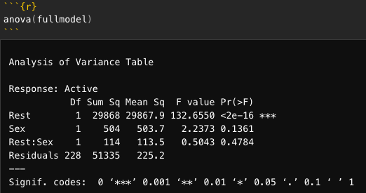
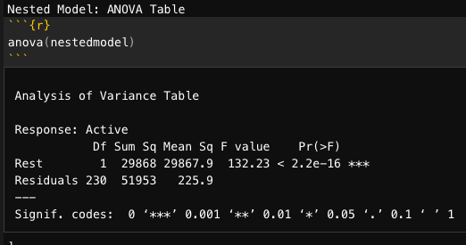

```{r xaringan-themer, include=FALSE}
# sds::duo_smith()
sds::mono_light_smith()
```

```{r setup, include=FALSE}
knitr::opts_chunk$set(echo = FALSE)
require(magrittr)
require(tidyverse)
```

## Outline for Today

- Multicollinearity

- Nested F-Tests: How to test whether one model is "better" than another?

- Categorical Explanatory variables

---
## Multicollinearity

**What is it?**

- When one or more of the predictors is strongly correlated with some combination of the other predictors in the set
    - True collinearity is when two factors are associated in an exact, linear combination
    - Near collinearity is when the correlation is high (and thus the $R^2$ is, too)
      
**Why is it a problem?**

- Individual coefficients and t-tests can be deceptive and unreliable.

---
## Intuition and Example

### Intuition: two variables that are highly related to each other

Modeling Weight as a function of Height ( $X_1$ ) and Inseam ( $X_2$ ): 


#### $$weight=\beta_0+\beta_1 Height+ \beta_2 Inseam + \epsilon$$

---
### Example: picking a group project team

  - You need the following skills: Bio, Lab, Stat, Computing, Writing
  - Who should be grouped together?
    
Name | Skills
-----| ------
Alphonse | Bio, Lab
Bertha | Computing, Stat
Claude | Bio, Lab, Writing
Daphne | Lab, Writing
Ernie | Bio, Lab, Computing
Fred | Stat, Writing

---
class: center

## If predictors are highly correlated among themselves:

## The regression coefficients and tests can be extremely variable and difficult to interpret individually.
  
---
## Example of Height and Inseam

We want to model Weight as a function of Height, Inseam, and Age

We simulate data for the purposes of the example with the following correlation matrix:

````{r, message=FALSE, warning=FALSE}
## Drawn from - http://www.quantumforest.com/2011/10/simulating-data-following-a-given-covariance-structure/

library(car)     # for vif
set.seed(8675309)
# number of observations to simulate
nobs = 100
 
# Using a correlation matrix (let' assume that all variables
# have unit variance
M = matrix(c(1, 0.7, 0.7, 0.5,
0.7, 1, 0.95, 0.3,
0.7, 0.95, 1, 0.3,
0.5, 0.3, 0.3, 1), nrow=4, ncol=4)
 
# Cholesky decomposition
L = chol(M)
nvars = dim(L)[1]
 
 
# R chol function produces an upper triangular version of L
# so we have to transpose it.
# Just to be sure we can have a look at t(L) and the
# product of the Cholesky decomposition by itself
 
#t(L)
 
#t(L) %*% L
 
# Random variables that follow an M correlation matrix
r = t(L) %*% matrix(rnorm(nvars*nobs), nrow=nvars, ncol=nobs)
r = t(r)
 
rdata = as.data.frame(r)
names(rdata) = c('weight', 'height', 'inseam', 'age')
```

#### Correlation Coefficients

```{r, echo=TRUE}
# Correlation Coefficients Matrix
cor(rdata)
```

---
#### Model 1: Height and Age
```{r, message=FALSE, warning=FALSE}
m1 <- lm(weight ~ height + age, rdata)
summary(m1)
```

---
#### Model 2: Inseam and Age
```{r, message=FALSE, warning=FALSE}
m2 <- lm(weight ~ inseam + age, rdata)
summary(m2)
```

---
#### Model 3: Height, Inseam and Age
```{r, message=FALSE, warning=FALSE}
m3 <- lm(weight ~ height+inseam+age, rdata)
summary(m3)
```


---
## True collinearity

In most extreme cases - two variables are functions of the other:

  - Height ( $X_1$ )
  - Pants inseam ( $X_2$ )
    
Let's assume we're in a world where everyone's leg length is the same ratio of their height : inseam = 0.34*height

````{r, message=FALSE, warning=FALSE}
# from https://daviddalpiaz.github.io/appliedstats/collinearity.html
gen_exact_collin_data = function(num_samples = 100) {
  height_true = rnorm(n = num_samples, mean = 60, sd = 6)
  inseam_true = .34 * height_true + 3
  weight_true = 3 * height_true + rnorm(n = num_samples, mean = 0, sd = 1)
  data.frame(weight_true, height_true, inseam_true)
}

set.seed(8675309)
weightdata = gen_exact_collin_data()
cor(weightdata)
```


---
### True collinearity

````{r, message=FALSE, warning=FALSE}
weightdata_fit<- lm(weight_true ~ height_true + inseam_true, data = weightdata)
summary(weightdata_fit)
```

---
## How do we detect multicollinearity

### **Warning Signs:** High Correlation Coefficients

Original example (not perfect collinearity): What is the correlation between height and inseam?
```{r, message=FALSE, warning=FALSE}
rdata %>%
  summarise(ht_inseam_corr=cor(height,inseam))
```


### **Better Test:** Variance Inflation Factor (VIF)

#### $VIF = \frac{1}{1-{R_i}^2}$ where ${R_i}^2$ is for predicting $X_i$ using the other predictors.

- VIF > 5 $\sim$ ${R_i}^2$> 80%
- VIF $\geq$ 5 is questionnable
- VIT $\geq$ 10 is a problem

---
##  Calculating VIF manually

### $VIF = \frac{1}{1-{R_i}^2}$ where ${{R_i}^2}$ is for predicting $X_i$ using the other predictors.

#### The VIF for height used the $R^2$ from the model $Height = \beta_0+ \beta_1 \cdot Inseam + \beta_2 \cdot Age + \epsilon$

#### The VIF for inseam used the $R^2$ from the model $Inseam = \beta_0 + \beta_1 \cdot Height + \beta_2 \cdot Age + \epsilon$

#### **What's the model for the VIF of Age?**
  
``` {r, message=FALSE, warning=FALSE, echo=FALSE}
vif0<-lm(height~inseam+age, data=rdata)

vif1<-lm(inseam~height+age, data=rdata)

vif2<-lm(age~inseam+height, data=rdata)
```

  - Height ( $R^2$ = `r round(summary(vif0)$r.squared, digits=3)`): 1/(1-`r round(summary(vif0)$r.squared, digits=3)`) = `r round((1/(1-summary(vif0)$r.squared)), digits=3)`
  - Weight ( $R^2$ = `r round(summary(vif1)$r.squared, digits=3)`): 1/(1-`r round(summary(vif1)$r.squared, digits=3)`) = `r round((1/(1-summary(vif1)$r.squared)), digits=3)`
  - Age ( $R^2$ = `r round(summary(vif2)$r.squared, digits=3)`): 1/(1-`r round(summary(vif2)$r.squared, digits=3)`) = `r round((1/(1-summary(vif2)$r.squared)), digits=3)`

---
##  Calculating VIF automatically 

#### We use the `vif()` function from the `car` package to do this automatically from a model that has all three explanatory variables.

```{r, echo=TRUE}

# Reminder - We already fit this
# Model 3 (slide #10): predictors 1,2 and 3
# m3 <- lm(weight ~ height+inseam+age, rdata)

require(car)
round(vif(m3), digits=3)
```

---
## What can you do about collinearity?

#### 1. Drop some of the predictors

#### 2. Combine some of the predictors

#### 3. Pay less attention to the individual coefficients and tests (depends on your goal...)

## Some other things you might see 

##### (Google is a black hole...)

#### $\frac{1}{1-{R_i}^2} = \frac{1}{Tolerance}$
#### Decomposing correlation matrices into eigenvalues as a diagnostic

---
## Collinearity Summary

- Be cautious about your interpretation of multiple regression models with correlated values

- Multicollinearity can produce counterintuitive parameter estimates and tests
    - Tip: If the F-test and the t-test cause you to draw opposite conclusions (i.e., significant F-test but non-significant t-tests), you might have collinearity.

- Ways to check:
    - Correlation coefficients
    - VIF, which tells you how much higher the variance ($\sigma_\hat{\beta_i}$) is due to the correlation between $x_1$ and $x_2$.

- What to do?
    - Drop or combine some of the predictors

---

class: center, inverse, middle

## Comparing Models: Nested F-Tests

---
## Tests to Compare Two Regression Lines

Y = Active pulse
$X_1$ = Resting Pulse
$X_2$ = Female (vs. Male - 1/0 indicator)

$ActivePulse=\beta_0 + \beta_1 RestingPulse + \beta_2 Female + \beta_3 RestingPulse \times Female + \epsilon$

#### **What is the test of different intercept?**

#### **What is the test of different slope?**

#### **What is the fitted equation for _Males_?**

#### **What is the fitted equation for _Females_?**

---
## Are these models are significantly different?

#### **What is the fitted equation for _Males_?**

$$ActivePulse_{Males}=\beta_0 + \beta_1 RestingPulse + \epsilon$$

#### **What is the fitted equation for _Females_?**

$ActivePulse_{Females}=(\beta_0 + \beta_1(X_1) + \beta_2(1) + \beta_3(1)X_1 + \epsilon)$ = 
$ActivePulse_{Females}=(\beta_0 + \beta_2)+ ((\beta_1 +\beta_3) RestingPulse) + \epsilon$

#### The difference between the models is both $\beta_2$ **and** $\beta_3$

---
## How do we test whether these models are significantly different?

- One at a time with t-tests:
  - $H_0: \beta_3 = 0$
  - $H_A: \beta_3 \neq 0$
- All terms at once with ANOVA:
  - $H_0: \beta_1 = \beta_2 = \beta_3 = 0$
  - $H_A: some \beta_i \neq 0$
    
### *How do we test $\beta_2$ and $\beta_3$ together?*

---
## Nested Models

#### If all predictors in Model A are also in Model B, Model A is *nested* in Model B.
  - Model A: $ActivePulse = \beta_0 + \beta_1 RestingPulse + \epsilon$ is nested in Model B: $ActivePulse = \beta_0 + \beta_1 RestingPulse + \beta_2 Female +\beta_3 RestingPulse \times Female + \epsilon$

### _Model B is the **Full** model, Model A is the **Nested** (or reduced) Model_

#### How can we:
  - Test whether we need the extra terms in Model B
  - Quantify how much the additional terms "add" to Model A?

---
## Nested F-Test

Basic idea:

1. Find how much "extra" variability is explained by the "new" terms being tested.

2. Divide by the number of new terms to get a Mean Square for the new part of the model. 

3. Divide this Mean Square by the MSE for the "full" model to get a test statistic. 

4. Compare the test statistic (t.s.) to an F-distribution.

$$ts=\frac{(SSM_\text{Full} - SSM_\text{Nested}) / (k_\text{Full} - k_\text{Nested})}{SSE_\text{Full}/ n-k-1_\text{Full}}$$

---
Formally, $\beta_i$ reflects all predictors that are included in the full model but not the nested model:

$H_0:$ $\beta_i = 0$ for all $\beta$ in $\beta_i$

$H_A:$ $\beta_i \neq 0$ for at least 1 $\beta$ in $\beta_i$ 

Conceptually:

$H_0:$ The nested (or smaller) model is all we need.

$H_A:$ We need the full model.

---
## Nested F-Test Example: Calculating Nested F test statistic manually

Let's calculate the Nested F Test Statistic for the Pulse Example:
```{r, echo=TRUE, message=FALSE}
require(Stat2Data)
data("Pulse")

fullmodel<-lm(Active~Rest+Sex+Rest*Sex, data=Pulse)
nestedmodel<-lm(Active~Rest, data=Pulse)
```

---
## Nested F-Test Example: Calculating Nested F test statistic manually

.pull-left[
Full Model: ANOVA Table
```{r out.width = "100%", fig.pos="h"}

```

Nested Model: ANOVA Table
```{r out.width = "100%", fig.pos="h"}

```
]

.pull-right[
### What are the values of the following:

$SSModel_\text{Full}$

$SSModel_\text{Nested}$

\# of predictors (or $k_\text{Full} - k_\text{Nested}$)

$SSE_\text{Full}$

$n-k-1$

$ts=\frac{(SSM_\text{Full} - SSM_\text{Nested}) / (k_\text{Full} - k_\text{Nested})}{SSE_\text{Full}/ n-k-1_\text{Full}}$

]
---  
## Nested F-Test Example: Calculating Nested F test statistic automatically

```{r, echo=TRUE}
anova(nestedmodel,fullmodel)
```


---
class: inverse, center, middle

## Moving from Binary to Categorical Explanatory Variables

---
## Interpreting Terms - Binary Explanatory Variables

Since Binary is a subset of Categorical, let's start there:

$income=\beta_0 + \beta_1 age + \beta_2 education + \beta_3 female + \epsilon$

If:

- Quantitative variables:
    - Income ($)
    - Age (years), and 
    - Education (years)
- Binary: 
    - Female is a binary, indicator variable where Female=1 or not-Female=0.

**How do you interpret each term in the model?**

<!---**_Answer_**: 

- For every additional year of age, one's income is expect to be higher/lower by, on average, $\beta_1$, than someone a year younger in the population, adjusted for education and gender.

- For every additional year of education, one's income is expect to change by, on average, $\beta_2$, than someone with one less year of education in the population, adjusted for age and gender.

- Females' income is expect to be, on average, $\beta_3$, higher/lower than people who are not females in the population, adjusted for age and education. --->

---
## Interpreting Terms - Binary -> Categorical Explanatory Variables

###Example 1
What we include *gender* rather than just female vs. non-female? Instead, you have a variable with three levels:

`gender` =
- 0 if Male
- 1 if Female
- 2 if Gender non-conforming, Trans*, GenderQueer

$income=\beta_0 + \beta_1 age + \beta_2 education + \beta_3 gender + \epsilon$

If Income ($), Age (years), and Education (years) are quantitative variables, and Gender is a *categorical* variable.

**How do you interpret each term in the model?**

<!--- **Answer**: Age and Education are the same as above. The $\beta_3$ term for gender is now interpreted as: For a one-unit difference in gender, people's income would be, on average, $\beta_3$ higher or lower, than someone with a different gender in the population, adjusted for age and education. 

 --->

---
## Interpreting Terms - Binary -> Categorical Explanatory Variables

$income=\beta_0 + \beta_1 age + \beta_2 education + \beta_3 gender + \epsilon$

#### interpreting categorical variables
This is a *very strange* interpretation. What does it mean to have a "1-unit increase" in gender? What are the units of gender? Why would you be interested in the average change in y *between gender identities* (i.e., for a 1-unit difference in y)?

**Essentially, gender is included here as a quantitative variable, when it is categorical. This approach does not make sense and should not be used.**

---
### Multiple Binary, Indicator Explanatory Variables

`female` =
- 0 if Not-Female
- 1 if Female

`male` =
- 0 if Not-Male
- 1 if Male

`Trans_NB` =
- 0 if cisgender
- 1 if Trans or Non-Binary

If Income ($), Age (years), and Education (years) are quantitative variables, and Female and Trans_NB are binary indicator variables as defined above.
$income=\beta_0 + \beta_1 age + \beta_2 education + \beta_3 Female + \beta_4 Trans_NB + \epsilon$

**How do you interpret each term in the model?**

<!---
**_Answer_**: 

- Age and Education are the same as above. 
- The $\beta_3$ term for Female is now interpreted as: Females have, on average, $\beta_3$ higher or lower income than men, in the population, adjusted for age and education. 
- The $\beta_4$ term for NonConforming is now interpreted as: Gender Non-Conforming people have, on average, $\beta_4$ higher or lower income than men, in the population, adjusted for age and education.
- This is a much more intuitive explanation than above where gender was included as a quantitative variable  --->
---
### Multiple Binary, Indicator Explanatory Variables

What about: $income=\beta_0 + \beta_1 age + \beta_2 education + \beta_3 Male + \beta_4 Female + \beta_5 Trans_NB + \epsilon$ ?

**How do you interpret each term in the model?**

<!--- **Answer**: This model won't estimate, because one of the gender dummy variables needs to be left out as a reference group. Remember from collinearity that this was true - it's a similar idea here where if you know about two of the three categories, you won't be able to separately estimate the third. --->
