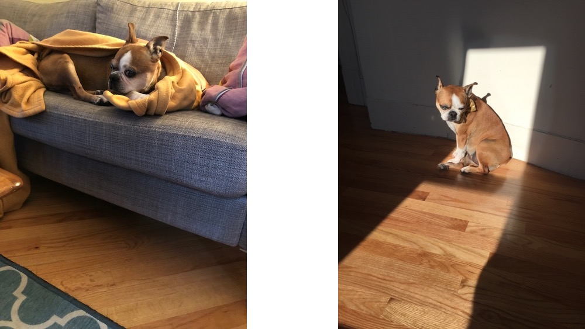
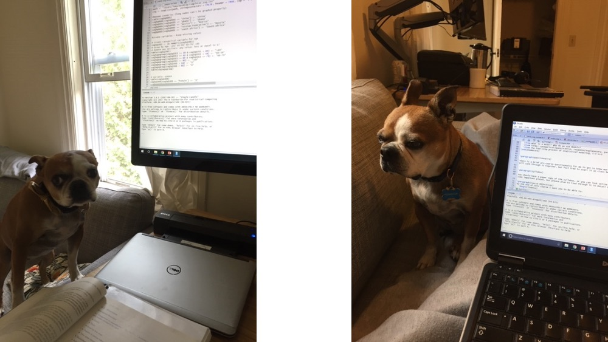
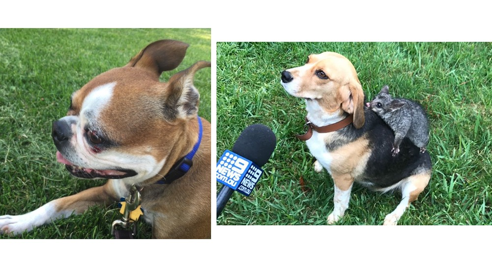

```{r include=FALSE}
# Some customization.  You can alter or delete as desired (if you know what you are doing).

# This changes the default colors in lattice plots.
#trellis.par.set(theme=theme.mosaic())  

# knitr settings to control how R chunks work.
require(knitr)
opts_chunk$set(
  echo=FALSE,
  tidy=FALSE,     # display code as typed
  size="small"    # slightly smaller font for code
)
load(url("http://sds291.netlify.app/23/LogisticReviewPractice.RData"))
```


These questions focus on my former dog, Porkchop. She was the best, as are Pants le Pants and Queen Pickles. (It turns out, being the best isn't zero-sum! It's an every-dog-way tie!) (It also turns out that I really like silly dog names that start with [the letter "P"](https://www.youtube.com/watch?v=LqSyHtEExBc). `r emo::ji("shrug")` `r emo::ji("heavy_heart_exclamation")` `r emo::ji("parking")` `r emo::ji("dog")`)

The data for these examples are available on the course website, and you can bring them into your local RStudio environment with the following code:

```{r, eval=FALSE, echo=TRUE}
load(url("http://sds291.netlify.app/23/LogisticReviewPractice.RData"))
```

# 1. Couch or Floor?

```{r, out.width='50%', fig.align = 'center', echo=FALSE, message=FALSE, warning=FALSE, error=FALSE}

```

Porkchop loved when the sun is out and shined through the windows. She also loved sitting on the couch. When the sun was out, she seemed to prefer laying on the floor in the spot of sun shining through the windows. When the sun was not out, she seemed to prefer hanging out on the couch, often under a blanket.

Porkchop had started Dogs 4 Data Science, a data science consulting firm by dogs and for dogs. Since I wouldn’t buy her a Fitbit to track her activity habits, she asked me to gather data for her. I collected data for roughly the last year and a half (n=430 days) of how sunny the weather was and where Porkchop was sitting when I got home from work on a weekday (she was very unpredictable on a weekend...).  These data are stored in the dataframe called `sun_couch`.


```{r, echo=TRUE}
gmodels::CrossTable(sun_couch$weather,sun_couch$spot, prop.r = FALSE, prop.c=FALSE,prop.t = FALSE, prop.chisq = FALSE)
```

## 1a. Use the information from the two-way table above to calculate the odds that Porkchop was on the floor on a sunny day.

```{r, echo=TRUE}
odds_floor_sunny <- 68/58
odds_floor_sunny
```

## 1b. Use the information from the two-way table above to calculate the odds that Porkchop was on the floor on a cloudy day.

```{r, echo=TRUE}
odds_floor_cloudy <- 79/112
odds_floor_cloudy

```


## 1c. As a data analysis consultant for Dogs 4 Data science, Porkchop asks you to use these data to fit a logistic regression model to estimate the relationship between the weather and where she was sitting. Show numerically how your answers from 1a & 1b correspond to this regression output. Briefly explain the relationship between the weather and where Porkchop is sitting in a sentence.


[*Note*: If you had run it this way, you would have been estimating the odds of being on the couch instead of the floor]
```{r, echo=TRUE}
m0a<-glm(spot~weather, data=sun_couch, family=binomial)
summary(m0a)
exp(coef(m0a))
```

These are similar to the odds of being on the couch if it's sunny (58/68 = `r 58/68`) and also the odds of being on the couch if cloudy (112/79 = `r 112/79` or exp(-0.1591 + 0.5081) = `r exp(-0.1591 + 0.5081)`) and the ratio of these sets of odds (cloudy vs. sunny) is $\frac{112/79}{58/68}$ = `r (112/79)/(58/68)`.  The odds of Porkchop being on the floor on a cloudy day was `r round(exp(coef(m0a)[3]), digits=3)` times the odds of her being on the floor on a sunny day.

[*Note*: Instead, you could ensure that the odds were the same as what you had calculated above by using the `relevel()` function to flip the order around.  There's no real way you would have known to need to do this, other than it's good practice to be sure your success and failure levels are set as needed. You won't need to deal with this on the exam.]

```{r, echo=TRUE}
#Setting the Reference Groups
sun_couch$spot <- relevel(sun_couch$spot, ref="Couch") # Couch as Reference / Failure b/c Floor is Success
sun_couch$weather <- relevel(sun_couch$weather, ref="Sunny") # Sunny as Reference / Intercept

m0b<-glm(spot~weather, data=sun_couch, family=binomial)
summary(m0b)
exp(coef(m0b))
```


In any case, remember...

odds floor sunny = $e^{\hat\beta_0}$

odds floor cloudy = $e^{\hat\beta_0 + \hat\beta_1}$

To compare the odds of sunny to cloudy, $\hat\beta_0$ cancels out, and you're left with: 

odds_cloudy / odds_sunny = $e^{\hat\beta_1}$ = Odds Ratio


```{r, echo=TRUE}
OR_flood_cloudyversussunny<-odds_floor_cloudy / odds_floor_sunny
OR_flood_cloudyversussunny
```

The odds of Porkchop being on the floor on a cloudy day was 0.6 times the odds of her being on the floor on a sunny day.

## 1d. Write the fitted regression equation (in logit form) of this regression model for Porkchop.

$logit(floor) = \hat\beta_0 + \hat\beta_1 Cloudy + \hat\beta_2 Partly Sunny$ 


## 1.e. Is there a significant difference in Porkchop being on the floor by the weather? Use the evidence from Porkchop’s requested regression model to test this question.


###  1.e.i. State the formula and related hypothesis for the test.

$H_0: \beta_i = 0$

$H_A: \beta_i \neq 0$


###  1.2.ii. Conduct the test and state your conclusion from the test in a sentence.

```{r, echo=TRUE}
#Method 1 - use anova()
anova(m0a)

#Method 2 - use lrtest()
#install.packages("lmtest")
library(lmtest)
lrtest(m0a)
```

# 2. Walks and Breaks

```{r, out.width='50%', fig.align = 'center', echo=FALSE, message=FALSE, warning=FALSE, error=FALSE}

```

Dogs 4 Data Science (D4DS) won a contract from the Humane Society to collect a data on well-being of dogs in Western Massachusetts. Porkchop and her colleagues randomly sampled 7200 dogs in Hampshire, Hampden, Franklin, and Berkshire Counties (the Western Massachusetts counties) and surveyed them on: 1. how long of a walk they take (in miles) (`miles`), 2. the day’s temperature (in degrees Farenheit) (`temperature`), and 3. whether they need to stop during the walk to have a break (1= Yes, took a break; 0 = No break) (`neededbreak`). This dataframe is called `walk`.

Based on her lived experience, Porkchop had a hypothesis that dogs of brachycephalic breeds – more commonly, have a ”smooshed face” instead of a full snout – would might need more breaks; the smooshed face makes it harder for them to breathe, especially in the heat. They also included a variable called ”`smooshface`” as measure of breed, which is 1 = Smooshed Face (e.g., pugs, boston terriers, bulldogs, shih tzus), or 0 = Not Smooshed / Full Snout (e.g., labradors, collies, poodles, all other breeds). See example of the latter below (right) -- with an opposum on their back!

```{r, out.width='50%', fig.align = 'center', echo=FALSE, message=FALSE, warning=FALSE, error=FALSE}

```

<br>


## 2a. Fit a simple logistic regression model of the relationship between miles of the walk and whether the dog needed a break (call this `model1`). 


```{r}
model1<-glm(neededbreak~miles, data=walk, family=binomial)
summary(model1)
```

Calculate and interpret the estimated odds of needing a break for two dogs who went on a walk of 1 and 2 miles, respectively, from this model. Use this information to calculate the odds ratio of taking a break between walking 2 miles instead of 1 mile.

```{r}
odds_1mile <- exp(1.99743 + (0.50072 * 1))
odds_1mile
odds_2mile <- exp(1.99743 + (0.50072 * 2))
odds_2mile

odds_ratio <- odds_2mile / odds_1mile
odds_ratio
```

The odds, on average, of needing to take a break on a walk was 1.65 times higher, on average, than for a 1-mile shorter walk.

## 2b. Based on the model above, use only the coefficient `miles` to calculate the odds ratio of taking a break for `miles`. Interpret the OR in a sentence.


```{r}
exp(0.50072)
```

For every additional 1 mile of length of the walk, the odds of needing a break increase by 1.65-times, on average.

## 2c. Building on the regression model from 2a, fit another model that controls for whether the dog was a smooshed face breed (call this `model2`). Calculate the odds ratio of taking a break for `smooshface` and interpret it in a sentence.

```{r}
model2<-glm(neededbreak~miles + smooshface, data=walk, family=binomial)
summary(model2)
exp(coef(model2))
```

On average, the odds a dog with a smooshface would need a break is 3.5-times higher than a dog without a smoosh face, adjusted for the length of the walk.

## 2d. Building on the regression model from 2c, fit another model that controls also for temperature (call this `model3`). Calculate the odds ratio and its 95% CI for taking a break for `temperature`. Interpret each in a sentence.

```{r}
model3<-glm(neededbreak~miles + smooshface + temperature, data=walk, family=binomial)
summary(model3)

lci<-exp(0.018925 - (1.96*0.001807))
uci<-exp(0.018925 + (1.96*0.001807))
c(lci,uci)
exp(coef(model3))
exp(confint(model3))
```

For every additional degrees hotter in temperature, the odds of a dog needing a break increases by 1.02-times, on average, adjusted for miles and smoosh face.

We're 95% Confident that the true difference in odds between degree of temperature and needing a break is between 1.015 and 1.023.

## 2e. Finally, add to the model from 2d an interaction term between smooshed face and temperature (call this `model4`). Based this model, calculate the probability of taking a break for a dog with a smooshed face walking 2 miles in 70 degree weather. Calculate the probability for a dog without a smooshed face under the same conditions. 

```{r}
model4<-glm(neededbreak~miles + smooshface*temperature, data=walk, family=binomial)
summary(model4)
```

```{r}
logodds_smoosh <- 1.017265 + (0.523259 *2) + (0.671241 *1) + (0.017669 *70) + (0.018946 * 70 * 1)
logodds_notsmoosh <- 1.017265 + (0.523259 *2) + (0.671241 *0) + (0.017669 *70) + (0.018946 * 70 * 0)

pi_smoosh<- exp(logodds_smoosh) / (1 + exp(logodds_smoosh))
pi_smoosh

pi_notsmoosh<- exp(logodds_notsmoosh) / (1 + exp(logodds_notsmoosh))
pi_notsmoosh
```


## 2f. Based on the model from 2e, calculate the probability of taking a break for a dog with a smooshed face walking 2 miles in 80 degree weather. Calculate the probability for a dog without a smooshed face under the same conditions

```{r}
logodds_smoosh80 <- 1.017265 + (0.523259 *2) + (0.671241 *1) + (0.017669 *80) + (0.018946 * 80 * 1)
logodds_notsmoosh80 <- 1.017265 + (0.523259 *2) + (0.671241 *0) + (0.017669 *80) + (0.018946 * 80 * 0)

pi_smoosh80<- exp(logodds_smoosh80) / (1 + exp(logodds_smoosh80))
pi_smoosh80

pi_notsmoosh80<- exp(logodds_notsmoosh80) / (1 + exp(logodds_notsmoosh80))
pi_notsmoosh80
```


## 2g.  Is your 4th model (from 2e) better than your 2nd model (from 2c)? State your hypotheses, conduct the test, and intrepret your conclusion in a sentence in the context of this scenario.

```{r}
anova(model2,model4)

library(lmtest)
lrtest(model2,model4)
```

$H_0: \hat\beta_3 = \hat\beta_4 = 0$

$H_A: \hat\beta_i \neq 0$

$ G = -2LL_{nested} - -2LL_{full} = 3306.86 - 3182.12 = 124.7 $

Given the large test statistic for G (t.s.= 124.7) and the small p-value (<0.001), we reject the null and conclude that the model 4 with temperature and interaction between the temperature and smoosh face was a statistically better model fit to predict a dog needing a break.


# 3. Assumptions

What are the assumptions of these regression models and are they met? Briefly describe each assumption and state whether you believe they are met. If you cannot evaluate a given assumptions from the data provided, clearly state all steps you would take to evaluate that assumption.

1. Linearity

2. Randomness

3. Independence


# 4. Multiple Choice / Short Answer questions about R

Question 4 includes 6 multiple choice / short answer questions about ‘R‘ (4.A- 4.F). Here, we’re interested in a dog’s age (`age_ge10`: ≥10 years old = Yes, or <10 years old = No) and needing a break in dataset called `walk1`, presented below. Porkchop needs some advising on data wrangling in R to understand what’s going on with the code to generate dataset `walk2.` Brief answers are fine.

[**Note**: There won't be any questions like this on the 2020 exam. These are just for practice and reflection of what you've learned in R so far this semester.]

```{r, echo=FALSE, message=FALSE, warning=FALSE, error=FALSE}
library(tidyverse)
walk1 <- walk %>% 
  mutate(age_ge10=as.factor(if_else(age>=10, "Yes", "No"))) %>%
  group_by(age_ge10) %>%
  count(neededbreak) 
```

```{r, message=FALSE, warning=FALSE, error=FALSE}
head(walk1)
```

```{r, eval=FALSE}
walk2 <- walk1 %>%
  group_by(age_ge10) %>%
  mutate(pi=n/sum(n)) %>%
  filter(neededbreak==1) %>%
  select(age_ge10,neededbreak,pi)
```

## 4.a. - Mutate
### 4.a.i. What does the `mutate()` function do?

- Keeps observations
- Makes a new variable
- Combines two datasets
- Keeps columns
- Generates only binary variables F. Summarizes a variable

### 4.a.ii. What does the `mutate(pi=n/sum(n))` code do in this specific case? [Hint: the previous line of `group_by(age_ge10)` means that sum(n) is the total ”n” for each group of dogs by age (No, and Yes)]

<br>


## 4.b. - Filter
### 4.b.i. What does the `filter()` function do?

- Keeps observations
- Makes a new variable
- Combines two datasets
- Keeps columns
- Generates only binary variables F. Summarizes a variable

### 4.b.ii. What does the `filter(neededbreak==1)` code do in this specific case?

<br>


## 4.c. - Select
### 4.c.i. What does the `select()` function do?

- Keeps observations
- Makes a new variable
- Combines two datasets
- Keeps columns
- Generates only binary variables F. Summarizes a variable

### 4.c.ii. What does the `select(age_ge10,neededbreak,pi)` code do in this specific case?

<br>


## 4.d.  If you had a categorical, labeled factor variable of a dog’s age (age_cat: ”Young”, ”Mid- dle”, ”Old”), which of the following would generate an indicator variable of whether or not a dog was old. Select all that apply.

- mutate(as factor(if else(age cat==”Old”, ”Yes”, ”No”)))
- mutate(as factor(if else(age cat==”Old”,1,0)))
- mutate(as factor(if else(age cat==”Old”, ”Young”, ”Old”)))
- mutate(as factor(if else(age cat==”Young”,”Young”,”Middle/Old”)))

<br>


## 4.e. If you had a numeric (i.e., quantitative) variable of age in categories (‘age_cat_num‘:0,1,2), where 0=young, 1=middle, 2=old) what would the following regression model yield: `m0<- glm(outcome~age_cat_num, data=walk2, family=binomial))`.
- One coefficient, named age_cat_num
- Two coefficients, named age_cat_num1 and age_cat_num2
- Three coefficients, named age_cat_num0, age_cat_num1, and age_cat_num2

<br>


## 4.f. If `neededbreak` was a factor (`needbreakfactor`:Yes/No), what will this code do: `walk2$needbreakfactor<- relevel(walk2$needbreakfactor, ref="Yes")` for a subsequent logistic regression `m1<- glm(needbreakfactor~age_ge10, data=walk2, family=binomial))`?
- Estimates the log(odds) of needing a break
- Estimates the log(odds) of not needing a break
- Estimates the log(odds) of being at least 10 years old iv. Estimates the log(odds) of being under 10 years old

```{r, out.width='50%', fig.align = 'center', echo=FALSE, message=FALSE, warning=FALSE, error=FALSE}

```